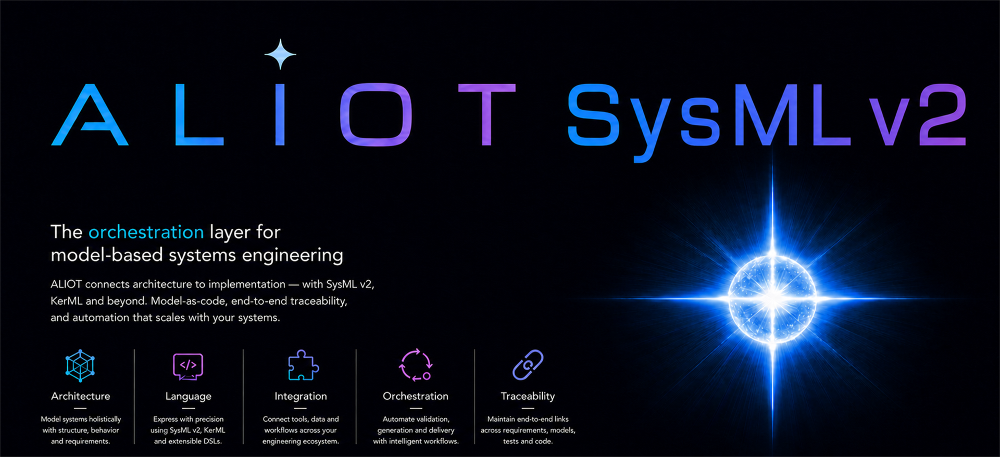

<p align="center">
  
</p>

<h1 align="center">SysML v2 for Visual Studio Code</h1>

<p align="center"><strong>Model as code. Understand it as diagrams. Keep both in sync.</strong></p>

<p align="center">
  <a href="https://marketplace.visualstudio.com/items?itemName=voidaliot.vscode-sysml-v2"><strong>Install</strong></a>
  · <a href="https://voidaliot.github.io/sysml-v2-vscext-release/"><strong>Explore the feature tour</strong></a>
  · <a href="https://voidaliot.github.io/sysml-v2-vscext-release/user-guide.html"><strong>Read the guide</strong></a>
  · <a href="https://github.com/voidaliot/sysml-v2-samples"><strong>Open the samples</strong></a>
</p>

> [!NOTE]
> The extension is under active development. Feedback and real-world models are welcome.

Write SysML v2 and KerML the way you write code—with completion, hover, deterministic diagnostics, refactorings, navigation, and formatting—then **see and edit the same model as live SysML v2 diagrams**. The OMG standard library is built in, so `import SI::*` works immediately. No Java runtime, PlantUML server, model upload, or cloud account is required.

## Why you'll like it

- 🎯 **The full language, not a subset** — every SysML v2 *and* KerML construct from the OMG specification, parsed by a real language server.
- 🖼️ **Diagrams you can edit** — all nine standard views in authentic SysML v2 notation, rendered on a React Flow canvas with SysML-specific vector nodes. Drag, resize, add, connect, rename — changes flow back to your source.
- 📚 **The OMG standard library, bundled** — `Parts`, `ISQ`, `SI`, `Requirements`, and the rest resolve out of the box, offline.
- 🧠 **Editor intelligence everywhere** — context-aware completion, rich hover, a documented diagnostic catalogue with one-click fixes, cross-file rename, and AST-based formatting.
- 🤖 **AI-agent ready** — server-backed language-model tools let VS Code AI agents reason about your model deterministically.
- 🔒 **Private by default** — zero telemetry. Nothing about you, your code, or your usage ever leaves your machine.
- ☕ **No runtime to install** — a pure TypeScript [Langium](https://langium.org) language server. No JDK, no separate generator.

## Quick start

1. **Install** from the [Visual Studio Marketplace](https://marketplace.visualstudio.com/items?itemName=voidaliot.vscode-sysml-v2). The **Get Started with SysML v2** walkthrough opens automatically (or run *Welcome: Open Walkthrough…*).
2. **Open a model** from the [sample repository](https://github.com/voidaliot/sysml-v2-samples), or create a `.sysml` file. The status bar reads **SysML: ready** once the bundled library is indexed.
3. **Type `sysml-`** and choose a scaffold such as `sysml-part-def`, `sysml-requirement`, or `sysml-state-machine`—there are 45+ snippets.
4. **Save** to run diagnostics and add unambiguous cross-package imports automatically.
5. **Run `SysML: Show Diagram`** (or use the graph button in the editor title bar) to open the live, editable diagram. Press `Ctrl+Alt+D` to switch between side and tab modes.

---

## Learn with real models

Clone the public sample workspace and open it directly in VS Code:

```bash
git clone https://github.com/voidaliot/sysml-v2-samples.git
code sysml-v2-samples
```

| Start here | What to explore |
| ---------- | --------------- |
| [E-mountain bike](https://github.com/voidaliot/sysml-v2-samples/blob/main/e-mountainbike.sysml) | The broadest guided tour: structure, actions, states, cases, requirements, and every exported diagram type. |
| [Software-defined vehicle](https://github.com/voidaliot/sysml-v2-samples/blob/main/sdv.sysml) | A larger architecture model for cross-file-style navigation, ports, interfaces, behavior, requirements, verification, and geometry. |
| [Drone](https://github.com/voidaliot/sysml-v2-samples/blob/main/drone.sysml) | A compact model for parts, ports, connections, and behavior. |
| [Flashlight](https://github.com/voidaliot/sysml-v2-samples/blob/main/flashlight.sysml) | A small first model for learning definitions, usages, and simple relationships. |
| [Vehicle](https://github.com/voidaliot/sysml-v2-samples/blob/main/vehicle.sysml) | A focused vehicle example for types, composition, and reusable definitions. |
| [Cruise ship](https://github.com/voidaliot/sysml-v2-samples/blob/main/cruise-ship.sysml) and [Robocopter](https://github.com/voidaliot/sysml-v2-samples/blob/main/robocopter.sysml) | Larger examples for experimenting with navigation and diagram selection. |

For a quick visual preview, browse the sample repository’s [exported SVG diagrams and Grid View CSV](https://github.com/voidaliot/sysml-v2-samples/tree/main/diagrams). Then open the matching `.sysml` file, run **SysML: Which Diagram?**, and edit either the source or canvas to see the round trip.

---

## Language intelligence

- **Syntax highlighting** for `.sysml` and `.kerml`, including quantity literals (`1500 [kg]`), escaped names (`'name with spaces'`), and the full operator set (`:>`, `:>>`, `::>`, `**`, `??`, `===`, `hastype`, `as`, `->`, `#( … )`, `.?`, …).
- **Smart completion** — 45+ snippets, context-aware keyword / member / import / unit completion for every SysML and KerML construct, **inline ghost-text suggestions**, and **signature help** for calc / action / constraint calls.
- **Hover** — element kind, typing, plain-English multiplicity, relationship details, the modeled doc comment, library-function signatures, and a *From standard library* link straight into the bundled OMG sources.
- **Diagnostics** — a stable, documented catalogue (LEX / SYN / RES / SEM / SSM / KSM / UNIT / STYL / MIG families) with per-code severity overrides, **dimensional analysis** of quantity expressions, and a **SysML v1 guardrail** that maps `block` / «stereotype» idioms to their v2 constructs.
- **Quick fixes & refactorings** — add a missing import, `&&`→`and`, `import…as…`→`alias`, add a missing `subject`, convert def↔usage, extract to a new package, move to a new file, generate a verification case from a requirement, and more.
- **Navigation** — document outline (`Ctrl+Shift+O`), workspace symbols (`Ctrl+T`), **cross-file** go-to-definition (into the read-only library too), find references (including `satisfy` / `verify` targets), **cross-file rename**, document highlight, and go-to-declaration for aliases.
- **Auto-import on save** — unambiguous unqualified cross-package names get their `import` added automatically; ambiguous ones open a picker.
- **Formatting** — AST-based, element-per-line, with author-placed blank lines preserved (uses your `editor.tabSize`).
- **Semantic tokens & inlay hints** — definitions / usages / library symbols get distinct colors (a bundled **SysML v2 Default** theme is included; semantic highlighting is on by default), plus implicit-multiplicity and opt-in physical-dimension hints.
- **CodeLens** — *N references* on requirement defs, *Run verification* on verification-case defs (evaluates the case and reports pass/fail), and *Show diagram* on parts, states, actions, and cases.

## Live, editable diagrams

A live view of your model in the SysML v2 graphical notation, rendered on a **React Flow** canvas with SysML-specific vector nodes and automatic layouts — **not** PlantUML, no image server. The extension offers only the canvas/table views that actually have content in the file you're looking at, and keeps the Browser View available as a panel.

| View                 | Shows                                                                                                                                        |
| -------------------- | -------------------------------------------------------------------------------------------------------------------------------------------- |
| **General**          | definitions *and* usages, packages with «import» wiring, dependency / satisfy / verify / derive / allocate links, composition arrows for usage membership, the full specialization family (`{subsets}`, `{redefines}`, dashed hollow-triangle reference subsetting), variation / variant notation, metadata badges, calc / constraint / view compartments, annotations |
| **Interconnection**  | nested parts as resizable frames, box-like ports with edge docking, connectors routed below the parts, interfaces vs `=` bindings, item flows |
| **Action Flow**      | fork / join, decide / merge, send / accept, **performer swimlanes**                                                                          |
| **State Transition** | composite + `parallel` states, `trigger [guard] / effect`, «causation» links                                                                 |
| **Sequence**         | activation bars, dashed replies, event-occurrence chains, `occurrence def` / `occurrence` interactions                                       |
| **Case**             | case ovals inside the subject's classic v1 system-boundary box (default; or a linked part box), actors as stick figures                       |
| **Geometry**         | parts placed on an x/z coordinate frame                                                                                                      |
| **Grid**             | requirements table, **editable in place** — one column per attribute, separate Constraint / Satisfy / Verify columns, pass/fail status         |
| **Browser panel**    | the package / membership tree with expand/collapse, open by default in tab mode and toggleable in side mode                                  |

- **Editable.** A **view-specific toolbox** at the canvas side adds elements and draws relationships with two clicks — connect, transition, succession, message, include, satisfy — each view offering its own tools. In the Interconnection View, ports behave as small boxes with top / right / bottom / left docking points, so connectors attach to a real port edge instead of one center point; hovering a port highlights just that port and reveals its connect dots, and selected connectors keep draggable endpoints for reconnection. Connectors draw **below** the parts and are smart-routed around them; container part frames are kept translucent so the wiring beneath stays visible, while leaf parts keep an opaque, readable body. **Connector lines are movable**: drag the hollow dot on any segment to bend it through a new waypoint, drag a waypoint to move it, or double-click to remove it — waypoints follow the active line style and stay glued to their ports/parts. Drag to rearrange, **resize any node**, and rename / add / delete elements; changes are applied through the language server with cross-file rename and a syntax-safety re-parse.
- **Your layout, your repo.** Positions, sizes, and connector waypoints persist under `.vscode/sysml/diagrams/` — never in the `.sysml` text — so diagrams are git-friendly and the model stays text-only.
- **Theme-aware.** Every color adapts to your active VS Code theme (light, dark, high-contrast), with a redesigned toolbar of consistent theme-colored icons and a layout control tailored to each view's real options.
- **Side panel or full tab** — toolbar, Browser View panel on the left, toggleable properties inspector on the right, minimap, and SVG export. The BV and Properties toggles are arrow icons in the canvas's upper-left / upper-right corners in both modes. The side columns are resizable; the BV header shows a folder-tree icon plus **Browser View** in both modes, BV branches can be expanded/collapsed, and BV highlights the elements present on the current diagram. Toggle side/tab with `Ctrl+Alt+D`.
- **Not sure which view you need?** **SysML: Which Diagram?** recommends one from the question you want answered — and understands the SysML v1 names you already know (bdd, ibd, act, stm, sd, req, uc, pkg, par).

## The OMG standard library, built in

The full official model library ships with the extension, so `import Parts::*`, `import ISQ::*`, and `import SI::*` resolve immediately — no separate download, no GitHub clone.

| Layer                       | Files      | Examples                                                                                                 |
| --------------------------- | ---------- | -------------------------------------------------------------------------------------------------------- |
| Systems Library             | 21         | `Parts`, `Ports`, `Items`, `Actions`, `States`, `Requirements`, `Constraints`, `Cases`, `Views`, `SysML` |
| Kernel Libraries            | 3 sub-dirs | Kernel Data Type / Function / Semantic                                                                   |
| Domain — Quantities & Units | ~20        | `ISQBase`, `ISQMechanics`, `ISQElectromagnetism`, `SI`, `SIPrefixes`, `USCustomaryUnits`, …              |
| Domain — other              | ~10        | Analysis, Cause & Effect, Geometry, Metadata, Requirement Derivation                                     |

The library loads from a precomputed index at startup, so cold open is fast and nothing is parsed until you need it. Point at your own checkout with **`sysml.standardLibraryPath`** — it accepts an unzipped `sysml.library/` tree, a `.kpar` archive, or a directory of `.kpar` archives. JSON abstract-syntax archives are projected to readable `.sysml` for indexing.

## Works with your AI agents

The extension exposes a native VS Code **language-model tool** surface for agents that can use VS Code tools, including GitHub Copilot Chat / agent mode. These tools are contributed in the extension manifest, activate on demand, and are backed by the SysML language server instead of prompt-only guessing:

| Prompt reference | Tool | What it gives an agent |
| ---------------- | ---- | ---------------------- |
| `#sysmlAgentGuidance` | `sysml_agent_guidance` | SysML modeling pipeline, hard rules, validation checklist, and quick-reject patterns |
| `#sysmlContext` | `sysml_agent_context` | Active document or selection text, diagnostics, imports, and indexed symbols |
| `#sysmlValidateDraft` | `sysml_validate_draft` | Parser/diagnostic validation for proposed SysML/KerML text; returns a `WorkspaceEdit` only when no error diagnostics remain |
| `#sysmlSearchLibrary` | `sysml_search_library` | Real bundled standard-library packages, types, symbols, and unit names |
| `#sysmlResolveSymbol` | `sysml_resolve_symbol` | Workspace/library symbol matches plus imports visible from the current document |
| `#sysmlRequirementTrace` | `sysml_requirement_trace` | Requirement definitions and `satisfy` / `verify` relationships from loaded SysML documents |
| `#sysmlExplainDiagnostic` | `sysml_explain_diagnostic` | Stable diagnostic-code explanations and deterministic mechanical fixes |

This is not a separate chatbot and it does not ship a model runtime, credentials, telemetry, an MCP server, or Claude/Codex-specific skill packages. Agents that consume VS Code language-model tools can discover these capabilities directly; agents that only consume MCP servers, standalone plugins, or their own skill format need a bridge before they can call the same deterministic SysML operations.

## Archive & JSON interchange

Open and extract OMG `.kpar` package archives, and import / export SysML v2 abstract-syntax JSON through generated textual projections — all from the command palette or the Explorer context menu.

## Private by default

This extension collects **no telemetry** and transmits nothing about you, your code, or your usage. There is no analytics SDK, no usage reporting, and no network calls beyond the local language server. That's a deliberate, privacy-first choice.

---

## Reference

<details>
<summary><strong>Settings</strong></summary>

Open **Settings → Extensions → SysML v2**, or edit `settings.json`:

| Setting                                           | Default        | What it does                                                                                                             |
| ------------------------------------------------- | -------------- | ------------------------------------------------------------------------------------------------------------------------ |
| `sysml.standardLibraryPath`                       | `""` (bundled) | External `sysml.library/` directory, `.kpar` archive, or directory of `.kpar` archives to use instead of the bundled one |
| `sysml.validation.severities`                     | `{}`           | Per-code severity overrides, e.g. `{ "STYL001": "off", "RES009": "error" }`                                              |
| `sysml.diagnostics.unusedImports`                 | `"off"`        | Report imports whose members are never referenced (`off` / `warning` / `error`)                                          |
| `sysml.diagnostics.units`                         | `true`         | UNIT001–005 dimensional-analysis checks on quantity expressions                                                          |
| `sysml.editor.autoImportOnSave`                   | `true`         | Add missing imports for unambiguous names when saving                                                                    |
| `sysml.inlineCompletion.enabled`                  | `true`         | Ghost-text inline suggestions                                                                                            |
| `sysml.inlineCompletion.categories`               | `[]` (all on)  | Opt out of individual inline-suggestion triggers                                                                         |
| `sysml.inlayHints.dimension`                      | `false`        | Physical-dimension hints after quantity expressions (opt-in)                                                             |
| `sysml.outline.hiddenCategories`                  | `[]`           | Hide documentation / representation outline groups                                                                       |
| `sysml.workspace.backgroundIndexing`              | `"imports"`    | Background-index unopened files — `imports` (only files referenced by open files) / `off` / `all`                        |
| `sysml.preview.diagrams.update`                   | `"on-save"`    | When the diagram re-renders (`live` / `on-save` / `manual`)                                                              |
| `sysml.preview.diagrams.defaultKind`              | `"gv"`         | Preferred primary view (`gv`, `iv`, `afv`, `stv`, `sv`, `cv`, `gev`, `grv`); Browser View is the BV panel                |
| `sysml.preview.diagrams.defaultMode`              | `"side"`       | Open diagrams as a side panel or a full tab                                                                              |
| `sysml.preview.diagrams.showPortLabels`           | `true`         | Port names next to the port stubs                                                                                        |
| `sysml.preview.diagrams.showMultiplicities`       | `false`        | `[1]`, `[0..*]` next to usage labels                                                                                     |
| `sysml.preview.diagrams.showSubjectAsBoundaryBox` | `true`         | Case View: draw the subject as a v1-style system-boundary box containing its cases (disable for a linked part box)       |
| `sysml.preview.diagrams.lineStyle`                | `"orthogonal"` | Edge routing — `orthogonal` (square elbows) / `straight` (direct) / `curved`                                             |
| `sysml.preview.diagrams.syncUsageToDef`           | `true`         | IV structural edits synchronize to the typed definition and allow drag-to-reparent; disable to keep edits local to usages |
| `sysml.trace.server`                              | `"off"`        | LSP trace verbosity — `messages` or `verbose` for debugging                                                              |

Editor behaviour like indent width and format-on-save uses VS Code's built-in `editor.*` settings. Diagram settings can also be overridden **per project** in `.vscode/sysml/project.json`, checked into your repo.

With `syncUsageToDef` on (the default), adding parts, ports, or connectors inside a typed IV usage targets the usage's definition, and a parent-changing drop highlights its destination while dragging, then updates the definition without a confirmation dialog. With it off, additions stay local to that usage (inherited paths are materialized as local redefinitions when necessary) and dropping a part into a different parent snaps back.

</details>

<details>
<summary><strong>Commands</strong> (palette: <code>Ctrl+Shift+P</code> → "SysML:")</summary>

- **SysML: Show Diagram** — open the live, editable diagram
- **SysML: Which Diagram? (view guidance)** — pick the question you want answered (or the v1 diagram you knew) and the recommended view opens
- **SysML: Toggle Diagram Side / Tab Mode** (`Ctrl+Alt+D`)
- **SysML: Restart Language Server**
- **SysML: Reload Standard Library**
- **SysML: Open Standard Library Folder**
- **SysML: Open .kpar Archive**
- **SysML: Extract .kpar Archive**
- **SysML: Open Abstract Syntax JSON**
- **SysML: Export Abstract Syntax JSON**
- **SysML: Show Syntax Tree**
- **SysML: Show Diagnostic Reference**
- **SysML: Report Parse Coverage**

</details>

<details>
<summary><strong>Diagnostic codes</strong></summary>

Run **SysML: Show Diagnostic Reference** for the in-editor catalogue. Any code's severity can be overridden with `sysml.validation.severities`.

| Family     | Codes                                                                        | Covers                                                                                                                                                                |
| ---------- | ---------------------------------------------------------------------------- | --------------------------------------------------------------------------------------------------------------------------------------------------------------------- |
| Lexical    | `LEX001`–`LEX009`                                                            | incomplete strings/comments/names, invalid escapes, non-canonical boolean operators, non-ASCII identifiers, trailing whitespace                                       |
| Syntax     | `SYN010`–`SYN102`                                                            | modifier ordering, multiplicity, specialization, expressions, connectors, imports/packages, annotations, behavior, requirements/cases/views, SysML/KerML disjointness |
| Resolution | `RES001`–`RES016`                                                            | unresolved or ambiguous names, visibility, wrong target kinds, package separators, imports/aliases, unused imports, auto-imports, library shadowing                   |
| Semantics  | `SEM001`–`SEM010`, `SSM008`–`SSM013`, `KSM002`–`KSM011`, `UNIT001`–`UNIT005` | modeling heuristics, requirement/case bodies, SysML/KerML well-formedness, dimensional analysis                                                                       |
| Style      | `STYL001`–`STYL007`                                                          | PascalCase definitions, camelCase usages, requirement docs, indentation, import ordering, recursive wildcards, single-element bodies                                  |
| Migration  | `MIG001`–`MIG002`                                                            | SysML v1 idioms (`block`, `activity`, `«stereotype»`) mapped to their v2 constructs with one-click rewrites                                                           |

</details>

<details>
<summary><strong>File support</strong></summary>

| Extension | Language            | Notes                                                                 |
| --------- | ------------------- | --------------------------------------------------------------------- |
| `.sysml`  | SysML v2            | Full grammar & services                                               |
| `.kerml`  | KerML               | Shares the grammar (includes the KerML kernel rules)                  |
| `.kpar`   | OMG package archive | Open / extract from the command palette or Explorer                   |
| `.json`   | abstract syntax     | Import as a generated `.sysml` projection; export from textual models |

</details>

---

## Attribution

The bundled `sysml.library/` files are taken verbatim from the [OMG SysML v2 Release](https://github.com/Systems-Modeling/SysML-v2-Release) under their LICENSE / LICENSE-GPL, reproduced inside `resources/sysml.library/`.

Built with [Langium](https://langium.org), [vscode-languageclient](https://github.com/microsoft/vscode-languageserver-node), and [React Flow](https://reactflow.dev).

## Issues & feedback

The extension is being actively developed. If you have any feedback, feature suggestions or bug reports feel free to use the marketplace comment section.

Open an issue at <https://github.com/voidaliot/sysml-v2-vsc-ext/issues>.
