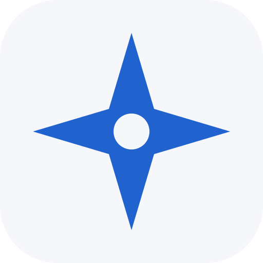
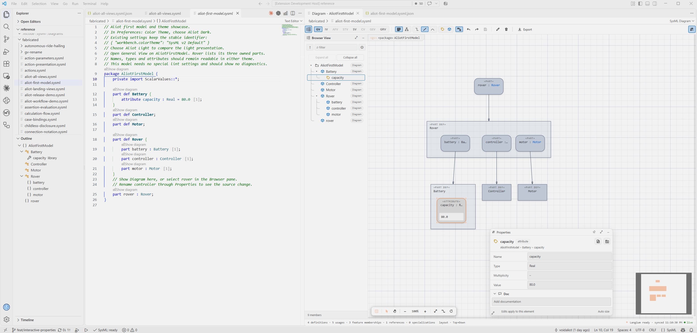
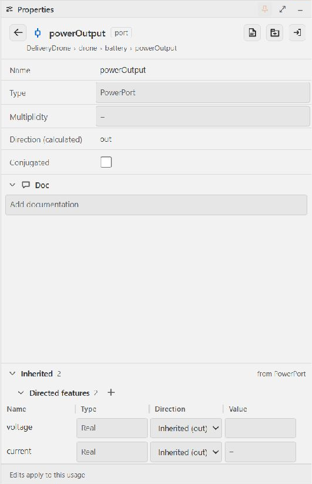

# Aliot SysML v2

**Model as code. See the system.**

Edit SysML v2 as text and diagrams. Built-in validation and AI tools.

[Install in VS Code](https://marketplace.visualstudio.com/items?itemName=voidaliot.vscode-sysml-v2) · [Explore Aliot](https://voidaliot.github.io/sysml-v2-vscext-release/) · [User guide](https://voidaliot.github.io/sysml-v2-vscext-release/user-guide.html) · [Samples](https://github.com/voidaliot/sysml-v2-samples)

<picture>
  <source media="(prefers-color-scheme: dark)" srcset="assets/product/v045-workspace-dark.png">
  
</picture>

_Actual VS Code capture. Images follow your GitHub light or dark preference._

## Get started

1. Install **Aliot SysML v2** from the Marketplace.
2. Open a `.sysml` or `.kerml` file. Try the [small rover model](assets/samples/aliot-first-model.sysml), or run **SysML: New Model…**.
3. Wait for **SysML: ready**, then run **SysML: Show Diagram**.
4. Edit source or use diagram Properties and context menus. Save the model and its layout with **Save All**.

Prefer a local installer? Find the VSIX packages in [releases](releases/). In VS Code, run **Extensions: Install from VSIX…**. See the [changelog](CHANGELOG.md) for version details.

## See the editing workflow

Edit inherited values in Properties to create local overrides. The battery capacity changes from 80 to 95. Its definition and spare battery stay at 80. Port inspection exposes conjugation, direction and inherited directed members.

<picture>
  <source media="(prefers-color-scheme: dark)" srcset="assets/product/v045-properties-after-dark.png">
  
</picture>
<picture>
  <source media="(prefers-color-scheme: dark)" srcset="assets/product/v045-properties-port-dark.png">
  
</picture>

[Play the real screenshot sequence](https://voidaliot.github.io/sysml-v2-vscext-release/#editing). The page provides stills and a Play/Stop control. These are captured states, not a continuous recording.

## Navigate the hierarchy

Choose the **Diagram** pill beside propulsion in the Browser to open its subsystem. Use **Up** beside the filter to return to the parent's General View.

<picture>
  <source media="(prefers-color-scheme: dark)" srcset="assets/product/v045-hierarchy-subsystem-dark.png">
  
</picture>

Try the [capture model](assets/samples/release-demo-before.sysml). Compare the [light navigation GIF](assets/product/v045-hierarchy-light.gif) or [dark navigation GIF](assets/product/v045-hierarchy-dark.gif).

## What you can do

| Workflow          | Included support                                                                                                          |
| ----------------- | ------------------------------------------------------------------------------------------------------------------------- |
| Write models      | Completion, hover, navigation, rename, formatting and diagnostics for SysML v2 and KerML                                  |
| Edit diagrams     | General, Interconnection, Action Flow, State Transition, Sequence, Case, Geometry and Grid views, with Browser navigation |
| Reuse the library | Bundled OMG SysML v2 and KerML standard library, including quantities and units                                           |
| Work with agents  | Optional model context, validation, library search and requirement-trace tools for compatible VS Code AI agents           |
| Automate checks   | `sysml-validate` for validation and `sysml-diagram` for diagram export in desktop and CI workflows                        |

AI tools need a separately configured compatible agent. Aliot does not include an AI model or credentials. Core modeling works without an AI account, Java or PlantUML.

## Choose a model

- [Small rover](assets/samples/aliot-first-model.sysml): three parts and a value to edit.
- [Drone](https://github.com/voidaliot/sysml-v2-samples/blob/main/drone.sysml): parts, ports, connections and behavior.
- [Software-defined vehicle](https://github.com/voidaliot/sysml-v2-samples/blob/main/sdv.sysml): a larger architecture with interfaces and requirements.
- [All public samples](https://github.com/voidaliot/sysml-v2-samples): source models and exported diagrams.

## Desktop, browser and themes

Language services and editable diagrams work in desktop VS Code, vscode.dev and github.dev. Archive and abstract-syntax interchange operations, and the companion CLIs, need a desktop environment. See the [guide](user-guide.md) for details.

Choose **Aliot Dark** or **Aliot Light** in **Preferences: Color Theme**. The themes retain their old settings identifiers, `SysML v2 Default` (dark) and `SysML v2 Gray` (light), so existing selections remain valid. The website has its own light/dark toggle.

## Feedback and releases

This repository hosts the public website, documentation and release artifacts. It is not the extension source repository.

Report problems in [Issues](https://github.com/voidaliot/sysml-v2-vscext-release/issues). Include the extension version, a small model, the view name and a screenshot when relevant. The project is under active development.

For media maintenance, see [MEDIA-GUIDE.md](MEDIA-GUIDE.md). The existing historical screenshots remain available under `assets/screenshots/`.

## Privacy and license

Aliot collects no telemetry. Model files stay in your local or browser workspace unless you share them through another service. Optional AI agents handle shared context under their own policies.

Aliot uses the [Freeware License](LICENSE). Bundled libraries and third-party components retain their own licenses; see the [extension documentation](https://marketplace.visualstudio.com/items?itemName=voidaliot.vscode-sysml-v2).

Architecture, Language, Integration, Orchestration, Traceability. The ideas behind the Aliot name.
