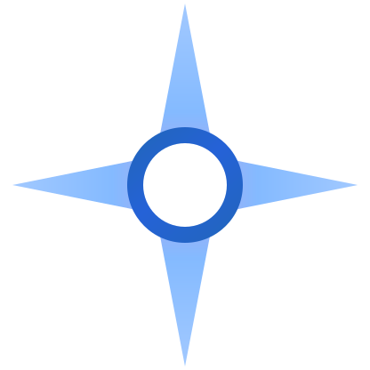
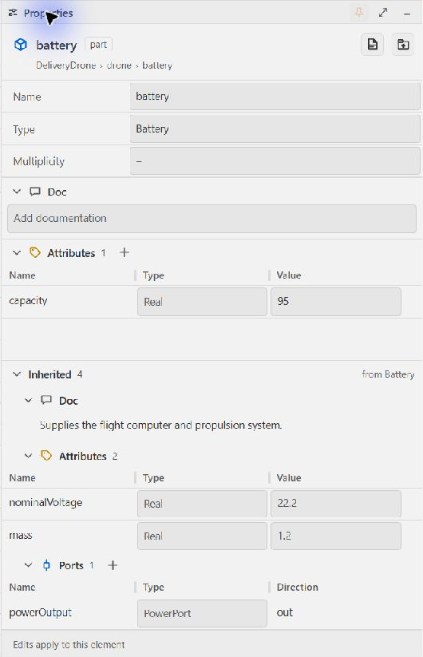
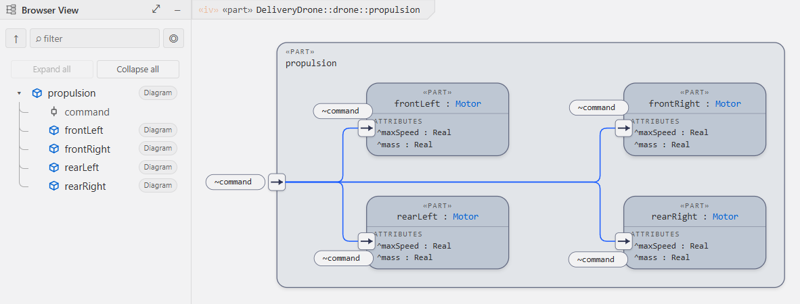
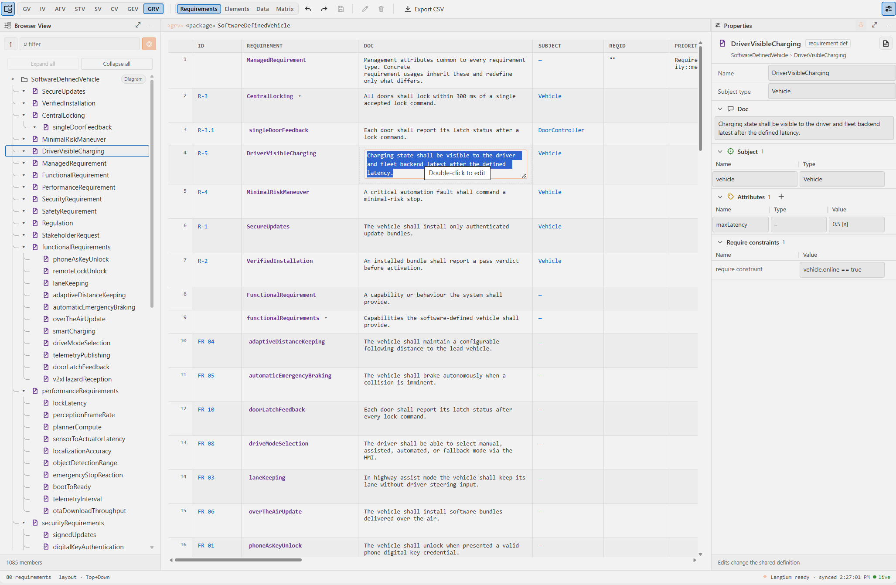

<p align="center">
  <picture>
    <source media="(prefers-color-scheme: dark)" srcset="assets/brand/aliot-star-dark.svg">
    
  </picture>
</p>

# Aliot SysML v2 User Guide

This guide explains how to use the SysML v2 VS Code extension to author and navigate SysML v2 and KerML models.

---

## Contents

1. [What is SysML v2?](#1-what-is-sysml-v2)
2. [Getting Started](#2-getting-started)
3. [Core Language Concepts](#3-core-language-concepts)
4. [Writing Your First Model](#4-writing-your-first-model)
5. [The Flashlight Example Explained](#5-the-flashlight-example-explained)
6. [Key Language Constructs](#6-key-language-constructs)
7. [Extension Features](#7-extension-features)
8. [Configuration](#8-configuration)
9. [Troubleshooting](#9-troubleshooting)
10. [Further Reading](#10-further-reading)

---

## 1. What is SysML v2?

**SysML v2** (Systems Modeling Language version 2) is an OMG standard for model-based systems engineering (MBSE). It defines a textual notation that lets you describe a system's structure, behavior, requirements, and verification cases in plain-text files that can be version-controlled, reviewed, and generated from.

**KerML** (Kernel Modeling Language) is the semantic foundation that SysML v2 is built on. You generally author models in SysML; KerML is relevant if you are working close to the metamodel or building tooling.

Aliot supports both languages with their own file extensions:
- `.sysml`. SysML v2 models
- `.kerml`. KerML models

---

## 2. Getting Started

### Opening a model file

Install **Aliot SysML v2** from the [Visual Studio Marketplace](https://marketplace.visualstudio.com/items?itemName=voidaliot.vscode-sysml-v2). Choose **Aliot Light** or **Aliot Dark** with **Preferences: Color Theme**.

1. Open VS Code and load a folder that contains `.sysml` files, or create a new file with the `.sysml` extension.
2. The extension activates automatically when VS Code detects a `.sysml` or `.kerml` file in the workspace.
3. Check the bottom-right status bar. it should show **SysML** (or **KerML**) as the language identifier.

### Running the examples

Download a model from the [public SysML samples repository](https://github.com/voidaliot/sysml-v2-samples):

- **[Flashlight](https://github.com/voidaliot/sysml-v2-samples/blob/main/flashlight.sysml)**: the compact starter model (walked through in section 5).
- **[Software-Defined Vehicle](https://github.com/voidaliot/sysml-v2-samples/blob/main/sdv.sysml)**: a larger architecture with structure, interactions, requirements and verification.
- **`.vscode/sysml/project.json`**. checked into your repo, overrides the `sysml.preview.diagrams.*` settings per project (it accepts the same flat `sysml.*` keys as `.vscode/settings.json`).

Open either model to see syntax highlighting in action:

- Keywords like `package`, `part def`, `port def`, `requirement def` are highlighted.
- Comments (`//`, `/* */`, `doc /* */`) are styled distinctly.
- Qualified names (`ScalarValues::*`), multiplicity (`[*]`), operators (`:>`, `:>>`, `~`) are coloured.

### Restarting the language server

If the language server stops responding, run **SysML: Restart Language Server** from the Command Palette (`Ctrl+Shift+P`).

### Try Properties editing

Download the [delivery drone model](https://github.com/voidaliot/sysml-v2-samples/blob/main/release-demo-before.sysml) and open it in VS Code. These pictures show Aliot running in VS Code.

1. Open the diagram for the `drone` part. Choose **Interconnection View**, orthogonal lines and **Fit**.
2. Select `battery`. Open **Properties** with the rightmost toolbar button, then expand **Inherited**.
3. Change `capacity` from `80` to `95`. Press Enter or use the check icon to apply.
4. Inspect the source. A local `attribute :>> capacity = 95;` now belongs to this battery. The `Battery` definition and `spareBattery` still use `80`.
5. Use native Undo to reverse the edit. Escape cancels an unapplied draft. Clearing the local override restores the inherited value.



Inspect `powerOutput` to see inherited `voltage` and `current` members, the calculated direction and the **Conjugated** control. Use a member row's arrow to inspect its details, then **Back** to return. Choose **Open declaration** when you intend to edit the shared definition.

Compare the [before](assets/product/v045-properties-before-light.png) and [after](assets/product/v045-properties-after-light.png) Properties captures to see the applied local override.

### Navigate the model hierarchy

1. Open **Browser** with the leftmost toolbar button. Expand `drone` to find `propulsion`.
2. Click the **Diagram** pill on `propulsion` to open its diagrams. Choose **Interconnection View** to see the four motors and their command connections.
3. Use **Up** beside the Browser filter to return to the parent's **General View**. This clears the Browser filters. Up is disabled at the file root.
4. Select a Browser row to inspect its Properties. Use its Diagram pill when you want to change the diagram's root.



See the [hierarchy sequence](assets/product/v045-hierarchy-light.gif) or download the [model after editing](https://github.com/voidaliot/sysml-v2-samples/blob/main/release-demo-after.sysml) to compare the source.

---

## 3. Core Language Concepts

### Packages

Every model is organised into **packages**. A package is a named namespace:

```sysml
package VehicleModel {
    // definitions and usages go here
}
```

Packages can be nested, and you import from other packages with `import`:

```sysml
private import ScalarValues::*;    // import everything from ScalarValues
import ISQ::MassValue;             // import a single type
```

### Definitions vs. Usages

The most important concept in SysML v2 is the **Definition / Usage** split:

- A **definition** (`part def`, `port def`, `item def`, …) declares a reusable type.
- A **usage** (`part`, `port`, `item`, …) instantiates a definition inside another element.

```sysml
// Definition. reusable type
part def Battery {
    port supply : PowerOutPort;
}

// Usage. Battery is used inside Flashlight
part def Flashlight {
    part battery : Battery;   // usage
}
```

Think of definitions as classes and usages as fields/properties.

### Specialization and Typing

| Syntax | Meaning |
|---|---|
| `part def X :> Y` | X specialises (inherits from) Y |
| `part def X :>> feature` | X redefines a feature inherited from its parent |
| `part x : Y` | usage x is typed by definition Y |
| `port def P :> ~Q` | P is the conjugate of Q (port direction is flipped) |

### Modifiers

Modifiers appear before the element kind keyword:

```sysml
abstract part def Vehicle { ... }
constant attribute mass : MassValue;
in  port input  : DataInPort;
out port output : DataOutPort;
```

Common modifiers: `abstract`, `variation`, `variant`, `derived`, `constant`, `ref`, `in`, `out`, `inout`.

---

## 4. Writing Your First Model

Create a file `my-model.sysml`:

```sysml
package MySystem {

    private import ScalarValues::*;

    // -- Types --

    item def Signal;

    port def SensorOutPort {
        out data : Signal;
    }

    port def SensorInPort :> ~SensorOutPort;

    // -- Components --

    part def Sensor {
        port out : SensorOutPort;
    }

    part def Processor {
        port in : SensorInPort;
    }

    // -- System assembly --

    part def System {
        part sensor    : Sensor;
        part processor : Processor;

        connect sensor.out to processor.in;
    }
}
```

Save the file. Syntax highlighting applies immediately, diagnostics appear in the Problems panel, undefined names are underlined with quick fixes, and **SysML: Show Diagram** renders the system. try the Interconnection View on `System`.

---

## 5. The Flashlight Example Explained

The file [flashlight.sysml](https://github.com/voidaliot/sysml-v2-samples/blob/main/flashlight.sysml) is the compact end-to-end demo. Here is a section-by-section walkthrough.

### 5.1 Package and imports

```sysml
package FlashlightModel {
    private import ScalarValues::*;
    private import ISQ::*;
    private import SI::*;
```

`ScalarValues`, `ISQ`, and `SI` are SysML v2 standard library packages. They supply typed attribute types like `VoltageValue`, `LuminousIntensityValue`, and unit literals like `[cd]` (candela).

### 5.2 Items. things that flow

```sysml
item def Light;
item def Electricity;
```

`item def` declares the kinds of physical or information payload that can flow through ports and connections.

### 5.3 Port definitions

```sysml
port def PowerOutPort {
    out current : Electricity;
}

port def PowerInPort :> ~PowerOutPort;   // conjugate
```

`PowerInPort` is declared as the **conjugate** of `PowerOutPort` using `~`. Conjugation flips all directional features: an `out` in the original becomes an `in` in the conjugate. This is the standard SysML idiom for matching complementary interfaces.

### 5.4 Part definitions

```sysml
part def Battery {
    doc /* DC power source. */
    port supply : PowerOutPort;
    attribute capacity : ElectricChargeValue;
    attribute nominalVoltage : VoltageValue;
}
```

`doc /* … */` attaches a documentation comment to the element. `attribute` declares a typed property.

### 5.5 System composition

```sysml
part def Flashlight {
    part battery : Battery;
    part switch  : Switch;
    part bulb    : Bulb;

    connect battery.supply to switch.in;
    connect switch.out     to bulb.supply;
```

Nested `part` usages compose the system. `connect` wires ports together using qualified names (`battery.supply`).

### 5.6 State machine

```sysml
    exhibit state mode {
        state off;
        state on;

        transition pressOn  first off accept signal: PressEvent then on;
        transition pressOff first on  accept signal: PressEvent then off;
    }
```

`exhibit state` attaches a state machine to the part. `transition` declares a labelled arc: starting state (`first`), trigger (`accept signal:`), and target state (`then`).

### 5.7 Requirements and verification

```sysml
requirement def MinimumBrightness {
    doc /* The flashlight shall emit at least 50 lumens when on. */
    subject flashlight : Flashlight;
    attribute minLumens : LuminousIntensityValue = 50 [cd];
    require constraint { flashlight.bulb.lumens >= minLumens }
}

part myFlashlight : Flashlight {
    attribute :>> bulb.lumens = 80 [cd];
    satisfy MinimumBrightness;
}
```

`requirement def` declares a formal requirement with a `subject` and a `require constraint`. `satisfy` on a usage asserts that the instance meets the requirement. Verification cases (`verification def`) document the test procedure and use `verify` to link back to the requirement.

---

## 6. Key Language Constructs

### Definitions

| Keyword | Purpose |
|---|---|
| `package` | Namespace grouping |
| `part def` | Structural component type |
| `port def` | Interface / connection point type |
| `item def` | Payload / flow type |
| `attribute def` | Typed value type |
| `action def` | Behaviour step type |
| `state def` | State machine type |
| `requirement def` | Formal requirement type |
| `verification def` | Test / verification procedure type |

### Usages (inside definitions or other usages)

| Keyword | Purpose |
|---|---|
| `part` | Structural member |
| `port` | Interface member |
| `item` | Flow instance |
| `attribute` | Value member |
| `action` | Behaviour step instance |
| `state` | State node |
| `connect` | Port-to-port binding |
| `satisfy` | Assert requirement satisfaction |
| `verify` | Assert requirement verification |

### Multiplicity

```sysml
part wheels : Wheel[4];       // exactly 4
part passengers : Person[0..5]; // 0 to 5
part sensors : Sensor[*];    // zero or more
```

### Qualified names

Use `::` to navigate namespaces:

```sysml
import ISQ::MassValue;
attribute mass : ISQ::MassValue;
```

---

## 7. Extension Features

### Editing

- **Syntax highlighting**: a full TextMate grammar (instant, no server needed) plus LSP semantic tokens with bundled `Aliot Dark` (dark, with the stable settings ID `SysML v2 Default`) and `Aliot Light` themes. The gray-light option uses Light Modern-like syntax colors on a light, slightly cool gray (`#F2F2F3`) instead of a white editor/workbench background. Standard-library symbols are styled distinctly.
- **Completion**. context-aware suggestions for keywords, definition/usage pairs, modifiers, relationship operators, import paths, library names, unit symbols, and members valid in the current body. plus 45+ snippets and **inline ghost-text completion** (`sysml.inlineCompletion.*`).
- **Hover**. markdown cards for every keyword, operator, and resolved reference: types, multiplicities in plain English, relationship details, library-function signatures, and a *From standard library* link into the bundled OMG sources. Documentation reads through: an element with no `doc` of its own shows the one from the nearest type it specializes, named and linked so you can see where it came from.
- **Navigation**. go-to-definition (into the read-only library too), go-to-declaration (aliases), find references (including `satisfy`/`verify`/connector-end string targets), rename across files (it carries expression operands and redefinition or subsetting targets too, not only typed references), document/workspace symbols, document highlight, and a hierarchical outline with configurable categories.
- **Diagnostics**. a stable, documented catalogue (LEX/SYN/RES/KSM/SSM/UNIT/STYL/MIG codes) with quick fixes for the mechanical ones (missing import, `&&`→`and`, `import as`→`alias`, missing subject, SysML v1 idioms → v2 constructs, …). Run **SysML: Show Diagnostic Reference** for the full list. Severities are configurable per code (`sysml.validation.severities`).
- **Formatting, signature help, inlay hints, CodeLens**. AST-stable formatter (4-space default via `editor.tabSize`), parameter help for calc/action/constraint calls, inlay hints for what the model says but the text does not, and CodeLenses for references, diagrams, and running verification cases. Put `// sysml-format ignore` on the line above an element to keep its hand-made layout exactly as written while the rest of the file is formatted.
- **Auto-import on save** (`sysml.editor.autoImportOnSave`, off by default). opt in to adding imports for unambiguous unqualified cross-package names when you save; ambiguous names open a picker after the original save completes.
- **Refactorings**. convert def↔usage, `import…as…`→`alias`, extract to package, move to new file, make the implicit standard-library specialization explicit, generate verification/analysis case from a requirement, and more (light-bulb menu).

### Saving and shared Undo

Diagram edits update the real `.sysml` and diagram JSON editor buffers. The JSON remains in a normal tab behind the diagram so VS Code includes it in **File > Save All** (`Ctrl+K`, then `S` on Windows). **Ctrl+S saves the active document**, so use the toolbar **Save** button (after Redo) or Save All to save both source and layout changes. The toolbar Save uses the normal VS Code save and lights up only while something is unsaved. Save All saves each dirty file; it is not an atomic transaction across files.

Use **File > Auto Save** to let VS Code save both document types automatically. The normal settings apply:

```json
{
  "files.autoSave": "afterDelay",
  "files.autoSaveDelay": 1000
}
```

With Auto Save off, JSON changes remain visible in the editor and dirty until saved. VS Code owns save failures and recovery. The extension creates a missing JSON file once, then uses text edits for changes. It does not delete/recreate the file, force each gesture to disk, or run its own save/retry timer. A disk save can still write the whole text file; small editor edits are not a promise of partial SSD writes. See [VS Code Save / Auto Save](https://code.visualstudio.com/docs/editing/codebasics#_save-auto-save).

Undo and Redo follow native document history. A diagram move joins its JSON edit to the source resource without changing source text. Related source/JSON changes and multi-file semantic edits are grouped workspace edits. The diagram stays active when using its Undo and Redo controls. Reset Layout and Reset Connector Routing use the same history. Rendering after an edit does not create extra geometry edits. Saved presentation changes are undoable. Pan and zoom use durable workspace state. Navigation, automatic routing caches and selection do not add modeling undo steps. Independent manual JSON edits use their native JSON resource history; saving does not combine separate histories.

### Inlay hints

Inlay hints show what the model says but the source does not write down. Each category is its own setting under `sysml.inlayHints.*`, and `sysml.inlayHints.enabled` turns the lot off in one place.

| Setting | Default | Shows |
|---|---|---|
| `sysml.inlayHints.enabled` | on | Master switch for everything below. |
| `sysml.inlayHints.multiplicity` | on | The implicit `[1]` on a usage with no multiplicity. |
| `sysml.inlayHints.dimension` | off | The resolved quantity value type or physical dimension. |
| `sysml.inlayHints.visibility` | off | The implicit `private` on an `import`. |
| `sysml.inlayHints.modifiers` | off | The implicit `ref` on an attribute usage, and the implicit `constant` on a feature that subsets a constant one. |
| `sysml.inlayHints.redefinition` | off | The parameter a directed parameter redefines by position. |
| `sysml.inlayHints.effectiveNames` | off | The name a feature takes from what it redefines. |
| `sysml.inlayHints.importedNames` | off | The other name a membership `import` also brings into scope. |
| `sysml.inlayHints.parameterNames` | off | The parameter each positional invocation argument binds to. |

Three of them are mechanical enough to write into the source: double-click the `private`, `ref` or `constant` hint and the modifier is inserted where the specification puts it. The rest are read-only, because the text they show is a consequence rather than something you would type. Ctrl+click a redefinition, imported-name or parameter-name hint to open what it names.

Every hint comes from something that actually resolved, so a category stays quiet rather than guessing: a declaration whose type does not resolve gets no redefinition hints. A hint also disappears the moment the source says the same thing itself.

A declaration that writes no specialization still has one. Its keyword fixes a base in the OMG standard library: a bare `part def` specializes `Parts::Part`, a bare `part` subsets `Parts::parts`, an `action def` specializes `Actions::Action`, and so on for every definition and usage family (OMG SysML v2 Part 1 section 7.6.8). The extension derives that base once and reads it everywhere: the hover card lists it beside the relationships the source writes, the type-conformance checks count it, and the abstract-syntax export emits it marked `isImplied`. There is deliberately no inline hint for it: the base is fixed by the keyword you already typed, so printing it beside the declaration restates the line rather than adding to it. Hover states it when you want it.

The edge stays out of your file. Nothing rewrites the declaration, and the export never writes an implied edge back as source on a round trip. To make it real text, use the light-bulb refactoring **Make implicit specialization explicit**, which writes `:> Parts::Part` into the declaration head. It is offered only where the base exists in the loaded library, and it disappears once the declaration states a specialization, so applying it twice does nothing.

An element can carry two names, a regular one and a short one (`view def <gv> GeneralView;`), and an `import` brings in both. `sysml.inlayHints.importedNames` shows the one the path does not write, so `import Views::GeneralView;` reads `import Views::GeneralView; also <gv>`. The name is printed the way its declaration writes it, so a short name keeps its angle brackets. An `expose` path is covered too. It is shown only for a membership path (not `Pkg::*`), only when the written path names exactly one element, and never when the import states its own `as` alias.

`sysml.inlayHints.parameterNames` names positional arguments: `Add(1, 2)` reads `Add(x = 1, y = 2)`. An argument that already writes `x = 1` is left alone, and the arrow form counts from the second parameter because the target fills the first (`x->select{…}` is `select(x, …)`). A `new Type(…)` is named from the type's own public features, in order, which is what a constructor binds.

The implicit `constant` follows KerML: a feature that subsets or redefines a `constant` feature is itself constant. It is shown only where the feature can vary at all, which means inside a part, item, action, connection or other occurrence-kind owner, KerML `class`, `struct` and `behavior` included. It is never shown inside a `datatype` or a plain `assoc`, which are not occurrences, and never on a `snapshot` or `timeslice` portion, on a composite action, or on a self or happens link.

### Formatter style options

`Shift+Alt+F` formats a file. Out of the box it does exactly what it always did: four-space indentation from `editor.tabSize`, one element per line, one blank line between top-level elements. Every option below is off or neutral by default, so adding the settings changes nothing until you turn one on.

Put them in `.vscode/settings.json` and commit the file. The language server, the editor and CI then all format the same way.

| Setting | Default | What it does |
|---|---|---|
| `sysml.format.indentStyle` | `editor` | `spaces` or `tabs` overrides `editor.insertSpaces`. |
| `sysml.format.indentSize` | `0` | Characters per level. `0` follows `editor.tabSize`. |
| `sysml.format.blankLines` | `1` | Blank lines between top-level elements (0 to 2). The first element is never pushed down. |
| `sysml.format.lineWidth` | `0` | Wrap comma lists past this column (40 to 400). `0` never wraps. |
| `sysml.format.emptyBody` | `preserve` | `semicolon` writes `part def P;`, `braces` writes `part def P { }`. |
| `sysml.format.quotedNames` | `preserve` | `unquoteSafe` drops the quotes from `'Wheel'` when the file declares it and the name is a plain identifier. |
| `sysml.format.documentationIndent` | `preserve` | `align` shifts a multi-line `doc` body to its owner's indentation. |
| `sysml.format.keywords` | `preserve` | `symbolic` writes `:>`, `:>>`, `::>`, `=>` and `:` for the keywords that mean the same. |

```jsonc
// .vscode/settings.json
{
  "sysml.format.indentSize": 2,
  "sysml.format.lineWidth": 100,
  "sysml.format.emptyBody": "semicolon",
  "sysml.format.keywords": "symbolic"
}
```

**Precedence.** A caller that passes `sysml.format.<option>` with the format request wins (that is how the headless tools override one option). Then these settings. Then, for indentation only and only while `indentStyle` is `editor` or `indentSize` is `0`, the editor's own `editor.tabSize` and `editor.insertSpaces`. A value the settings cannot use is refused with a warning and the previous value stays in force, so a typo never formats your repository differently in silence.

**How the options interact.**

- `indentStyle` and `indentSize` set the unit that `lineWidth` uses to indent a wrapped line, and the margin that `documentationIndent: align` shifts a body to.
- `emptyBody` only touches declarations the grammar lets you write either way, and never collapses a body that holds a comment, so nothing is lost.
- `lineWidth` breaks a line after every comma on it, in one pass, so no line it produces still holds one. It never re-joins lines you wrapped yourself.
- `keywords: symbolic` has no reverse. `:>` spells both `specializes` and `subsets`, so writing the words back would mean guessing which you meant.
- `quotedNames: unquoteSafe` rewrites a name and every use of it in the same file together, and skips any name whose bare spelling that file already uses. Quoted and unquoted spellings are still separate identities to this extension, so leave it off if other files spell the same name quoted.
- `// sysml-format ignore` outranks all of them: nothing inside the element it protects is rewritten.

<!-- ALL_VIEWS_START -->
### All-view model tour

Download [aliot-all-views.sysml](https://github.com/voidaliot/sysml-v2-samples/blob/main/aliot-all-views.sysml) from the public samples repository. One model supplies the SVG exports below, in Aliot Light and Aliot Dark. Grid View is shown in a VS Code screenshot and supports CSV export.

In VS Code, open the model, place the cursor inside the named anchor, then run **SysML: Show Diagram**. Choose the view from the diagram toolbar. Alternatively, find the element in Browser and choose its **Diagram** pill. Use **Up** to return to its parent's General View. Browser is available beside every view. Edit source or the supported Properties fields, then use **Save All** to save model and layout. Source Undo reverses model changes; geometry Undo reverses placement changes.

To reproduce the presentation, save [project settings](assets/samples/all-views-project.json) as `.vscode/sysml/project.json` and [view settings](assets/samples/all-views-layout.json) as `.vscode/sysml/diagrams/aliot-all-views.sysml.json` beside the downloaded model. Port labels are enabled. Connections use orthogonal lines; GV tree uses curved lines.

Install the [sysml-diagram npm package](https://www.npmjs.com/package/sysml-diagram) with `npm install -g sysml-diagram`. Run each command from the model's workspace. Add `--theme dark` for a dark export. To export the current VS Code arrangement, use **SysML: Copy Headless CLI Command** and omit `--auto-layout`.

#### General View: structure

Structure mode groups definitions, usages and features within their owning containers. Expand compartments to inspect members and follow relationships between elements.

Anchor: `AliotShowcase::Architecture`.

**Open and edit in VS Code:** Select **General View** and **Compartments**. Use **+** on a card to open its members. Right-click the canvas to add a definition or usage. Select a card and edit its Name, Type or attribute Value in Properties. Dragging cards changes the saved layout.


[Light SVG](assets/product/all-views/gv-structure-light.svg) · [Dark SVG](assets/product/all-views/gv-structure-dark.svg)

```sh
sysml-diagram export --file aliot-all-views.sysml --view gv --anchor AliotShowcase::Architecture --gv-mode group --theme light --auto-layout --out gv-structure-light.svg
```

#### General View: tree

Tree mode lays out feature membership from parent to child in source order. Branches and links reveal ownership, typing and other relationships across the model.

Anchor: `AliotShowcase::Architecture`.

**Open and edit in VS Code:** Select **General View** and **Tree**. Open a package with **+** and follow the usage lines to their definitions. Select a usage line to edit each part's Name and Multiplicity in Properties. Use **+** on a grouped usage pill to expand its individual parts.



[Light SVG](assets/product/all-views/gv-tree-light.svg) · [Dark SVG](assets/product/all-views/gv-tree-dark.svg)

```sh
sysml-diagram export --file aliot-all-views.sysml --view gv --anchor AliotShowcase::Architecture --gv-mode tree --theme light --auto-layout --out gv-tree-light.svg
```

#### Interconnection View

Shows how parts, ports, interfaces and connections form a system. Expand connection and interface blocks to inspect their ends, flows and nested ports.

Anchor: `AliotShowcase::Architecture::drone`.

**Open and edit in VS Code:** Select **Interconnection View**. Use **+** on powerFeed and commandBus to inspect their ends and flows. Open commands and drives to see nested ports. Drag between compatible port snap points to create a connection, or use the source port's context menu to choose an interface. Select a connection and drag an endpoint to reconnect it. Properties edits port names, types and conjugation. Auto-layout places ports toward their partners; manual port placements stay where you put them.


[Light SVG](assets/product/all-views/iv-light.svg) · [Dark SVG](assets/product/all-views/iv-dark.svg)

Use **+** on a connection or interface pill to open its block. Use **+** on commands or drives to expose their nested ports. The saved view settings open these details and use a top-down layout. Geometry attribute lists are closed here to focus on connections; Geometry View still uses their complete solids.

```sh
sysml-diagram export --file aliot-all-views.sysml --view iv --anchor AliotShowcase::Architecture::drone --theme light --auto-layout --out iv-light.svg
```

#### Action Flow View

Shows how actions proceed through control and item flows. Forks, joins, loops and performer lanes make concurrency and responsibility visible.

Anchor: `AliotShowcase::Mission`.

**Open and edit in VS Code:** Select **Action Flow View**. Right-click inside Mission to add actions, fork/join nodes or a loop. Drag between action handles to create a succession, or between compatible pins to create an item flow. Select an action and choose **Add performer** to assign a part. Edit conditions in the control frame or Properties. Change the poll and until expressions in source to explore retryLink.


[Light SVG](assets/product/all-views/afv-light.svg) · [Dark SVG](assets/product/all-views/afv-dark.svg)

```sh
sysml-diagram export --file aliot-all-views.sysml --view afv --anchor AliotShowcase::Mission --theme light --auto-layout --out afv-light.svg
```

#### State Transition View

Shows the states and transitions of a state machine, including triggers, guards, effects and concurrent regions.

Anchor: `AliotShowcase::FlightMode`.

**Open and edit in VS Code:** Select **State Transition View**. Right-click inside the machine to add states. Drag between state handles to create a transition. Select a transition to edit its trigger, guard and effect in Properties. Select active and use the Parallel property for concurrent regions. Open entry, do or exit details with **+** when they have a body.



[Light SVG](assets/product/all-views/stv-light.svg) · [Dark SVG](assets/product/all-views/stv-dark.svg)

```sh
sysml-diagram export --file aliot-all-views.sysml --view stv --anchor AliotShowcase::FlightMode --theme light --auto-layout --out stv-light.svg
```

#### Sequence View

Shows interactions over time as lifelines and ordered messages. Fragments express repetition or other control around message exchanges.

Anchor: `AliotShowcase::DeliverySequence`.

**Open and edit in VS Code:** Select **Sequence View**. Drag from a point on one lifeline to a point on another to create a message. Select a message to edit its name and payload in Properties. Drag it vertically to change its order. Edit the interaction's loop condition and participant references in source, then inspect the updated fragment. Participant header boxes do not start messages.



[Light SVG](assets/product/all-views/sv-light.svg) · [Dark SVG](assets/product/all-views/sv-dark.svg)

```sh
sysml-diagram export --file aliot-all-views.sysml --view sv --anchor AliotShowcase::DeliverySequence --theme light --auto-layout --out sv-light.svg
```

#### Case View

Shows cases in relation to their subject and actors. Relationships between cases make shared or dependent behavior visible.

Anchor: `AliotShowcase::Operations`.

**Open and edit in VS Code:** Select **Case View**. Enable the subject boundary box in the view settings. Select deliver and inspect its Subject and Actors in Properties. Use its context menu to add an include relationship, then choose ready. Edit case names in Properties; edit subject and actor declarations in source when the desired field is read-only.



[Light SVG](assets/product/all-views/cv-light.svg) · [Dark SVG](assets/product/all-views/cv-dark.svg)

```sh
sysml-diagram export --file aliot-all-views.sysml --view cv --anchor AliotShowcase::Operations --theme light --auto-layout --out cv-light.svg
```

#### Geometry View

Shows model geometry from shapes and coordinate frames, making spatial position, orientation and dimensions visible.

Anchor: `AliotShowcase::Architecture::drone`.

**Open and edit in VS Code:** Select **Geometry View**. Pan and zoom to inspect the assembly. The model's spatial data determines its plan or isometric presentation. Select a part to inspect its model properties. Edit its ShapeItems dimensions and coordinateFrame translation or rotation in source. Geometry follows those model values; moving a diagram label does not change a physical part's position.



[Light SVG](assets/product/all-views/gev-light.svg) · [Dark SVG](assets/product/all-views/gev-dark.svg)

```sh
sysml-diagram export --file aliot-all-views.sysml --view gev --anchor AliotShowcase::Architecture::drone --theme light --auto-layout --out gev-light.svg
```

#### Grid View: requirements

Lists requirements in a table for scanning, selection and editing supported fields. Adjust columns to focus on the data you need, or export the table as CSV.

Anchor: `AliotShowcase`.

**Open and edit in VS Code:** Select **Grid View**, then the **Requirements** preset. Edit a supported cell by double-clicking it. Use Properties for the selected requirement and the column controls to adjust the table. Choose **Export CSV** to share it. The screenshot below is the SDV sample; the downloaded CSV is the all-view model.

<picture>
  <source media="(prefers-color-scheme: dark)" srcset="assets/product/grid-vscode-dark.png">
  
</picture>

Use **Export CSV** in the Grid View toolbar, or run the command below. [Download the all-view model requirements CSV](assets/product/all-views/requirements.csv).

```sh
sysml-diagram export --file aliot-all-views.sysml --view grv --anchor AliotShowcase --theme light --auto-layout --out requirements.csv
```

SVG exports include visible labels. Long closed compartment rows can be shortened with an ellipsis, just as in the editor. Open the element or inspect Properties to read the full value.

<!-- ALL_VIEWS_END -->

### Diagrams. all nine SysML v2 standard views

Run **SysML: Show Diagram** (editor title button, Command Palette, or the *Show diagram* CodeLens). The extension detects which views have content in the active file and offers only those:

| View | Abbrev. | Shows |
|---|---|---|
| General View | `gv` | Definitions **and usages**, composition/specialization, packages and their contents, requirements with satisfy/verify/derive links, calcs/constraints/views with their compartments, annotations |
| Interconnection View | `iv` | Internal parts, directional ports, complete connection ends, **interfaces vs `=` bindings**, item flows |
| Action Flow View | `afv` | Actions (including actions owned by use-case usages), always-open structured action/inline-control frames with editable one-line clauses and pins, fork/join, decide/merge, succession flows, explicit send/accept endpoints, targeted terminate, parameter-pin flows, and resizable **performer-set lanes** |
| State Transition View | `stv` | States (composite + `parallel`), entry/do/exit, `trigger [guard] / effect` transitions, exhibitor boundaries, «causation» |
| Sequence View | `sv` | Lifelines, activation bars, messages (`name of ItemType`), dashed replies, event occurrences |
| Case View | `cv` | The familiar v1 look: case **ovals** stacked inside the subject (a part box linked by «subject» lines, or a v1-style boundary box via `showSubjectAsBoundaryBox`), stick-figure actors labelled `name : Type` standing left and right of the cases (above and below in Left→Right), includes, specialization |
| Geometry View | `gev` | Placed parts and shapes on an x/y plan or x/y/z isometric frame |
| Grid View | `grv` | Four toolbar presets: editable Requirements; Elements (Name, Type, Multiplicity, Doc; Kind read-only); Data (Name, Type, Value; Owner read-only); and Matrix. Matrix requires one toolbar-selected family: Allocation, Dependency, Satisfy, Flow, or Connection; Interface is not a Matrix family. Each preset and Matrix family remembers its own column order/widths. GRV is available when any preset has content. In Requirements, each per-attribute column title is the attribute's own name: double-click the title to rename that attribute on every requirement the table lists. The fixed titles (Id, Requirement, Doc, Subject, Constraint, Satisfy, Verify, Status) are read-only, and a rename that would give one requirement two attributes of one name is refused. |
| Browser View | `bv` | The hierarchical package/membership tree with expand/collapse |

Browser rows on the current diagram keep their normal colors. Other rows are gray in light and dark themes. Hover a row to see its type (defined by). Types remain searchable. Thin curved guides show parent-child membership.

Geometry View uses model data. A placed part is the same usage shown in the structural views. Its `SpatialItem` shape defines the solid and its `coordinateFrame` chain defines placement and orientation. Resolved rotations turn the solid itself, including cylinders used as wheels. A separate layout instance is not required.

- **One full editor tab**: the diagram opens as a normal editor tab with toolbar, Browser View panel, properties inspector, and minimap. To see it beside the model, split the editor in VS Code and drag the diagram tab into the second group. Browser uses a resizable left dock in every view. Its filter, scope toggle and Expand all/Collapse all buttons stay in place while only the membership tree scrolls. Its leftmost top-toolbar icon is the only way to reopen it. The rightmost toolbar icon opens Properties. Use the Properties pin to dock it on the right or make it float, including in Grid View. Your pin choice follows you across views. Drag floating Properties by its header, resize its edges or corner, or choose Fit to content. Resize a dock with its divider or arrow keys. Collapse returns its space to the diagram. Reopening and pinning preserve drafts and panel contents. Docked and floating sizes are remembered separately. Narrow windows keep the dock sides and scroll pane contents independently. Toolbar pane buttons stay visible when other controls scroll. Side panes start directly below the continuous toolbar underline. Their compact headers match the diagram title height. The diagram title has a thin outline, including its cut corner. The title starts to the right of Browser and overlays the canvas with a compact cut-corner tab. The canvas remains visible and interactive beside the tab. Grid View retains a static heading above its table. Diagram controls follow the active VS Code theme. Element and relationship colors adapt to the active theme. Closed elements are opaque; open frames use the configured 20% surface opacity. Compartment delimiters inherit their owner's outline. SVG exports use the same resolved palette and keep the same semantic fill on title and feature compartments.
- **Getting around a diagram**: the canvas has two tools, toggled beside the grid button at the bottom left. With the **arrow** (the default) the mouse wheel scrolls the diagram the way any window scrolls (a tilt wheel or `Shift`+wheel scrolls sideways), `Ctrl`+wheel (`Cmd`+wheel on macOS) zooms, and dragging is only ever an edit. An element moves from anywhere on its body. A container frame moves from its title strip because its interior is left click-through for the connectors drawn under it. A browser interruption cancels a port, pin, waypoint, or message drag, returns its preview to its starting position, and stops later pointer movement from changing it. With the **hand** you drag anywhere to pan and the wheel zooms, and nothing on the diagram can be moved or reconnected by accident, though selection and the right-click menus still work. Hold `Space` over the canvas to borrow the hand for a moment. Thin scrollbars run along the bottom and right edges. The zoom percentage in the control bar resets zoom to 100%. Pan, zoom and scrollbar position return to where you left each view, including IV, GV Compartments and GV Tree. These positions also survive reopening. Grid visibility is saved per view. A diagram without saved zoom opens at 100%, centred on its content.
- **General View has two independent modes**: both start with only the selected root's immediate children visible and closed. In **Compartments**, hover over or select an element to reveal its upper-right `+`. Use it on any element or package to open its child canvas. Closed cards list their hidden members. Closed packages show each direct member's kind and name in both modes, including nested packages. An open parent keeps its title and replaces the list with its child canvas. Explicit children appear as nodes, including attributes, actions, items, documentation and metadata, even without relations. Relations start hidden and can be enabled in the toolbar. In **Tree**, the top `+` opens a package's immediate members, including nested packages and definitions. On other elements it opens only part usages. The control appears on hover, selection or keyboard focus. Its `-` remains available after opening. A closed owner's usage line groups the part usages typed by a visible definition. Tree lays out complete families from top to bottom. Straight, Curved and Orthogonal work in both modes. Reset Connector Routing applies the selected style without moving cards. Each mode remembers its own layout, expansion and settings.
- **Editable Properties and attribute values**: selecting a typed usage keeps its declared Type or read-only Inherited type visible in Properties. Add a local Type override when needed; clearing it restores inherited typing without editing the base declaration. An unnamed redefinition keeps its inherited name read-only. Selecting a Tree usage line shows framed Name and Multiplicity fields for each usage. Attributes have an editable Value textbox both on their node and in Properties, including an empty field before a value is declared. Enter a complete SysML expression such as `1500 [kg]` or `baseMass + reserve`. Enter or blur commits; Escape cancels. Clear the field to remove its declared value. Validation rejects invalid expressions, and source Undo reverses the change.
- **Field Apply and Save**: Apply changes only that field and any source required by the operation. Other drafts remain pending. Unrelated display changes, including library-typed children, do not block a local note. A change to the same field or a required inherited declaration retains the draft for review. Source shifts use fresh ranges. Apply changes the editor buffer; Save and Auto Save control disk writes.
- **Compartment editors**: attribute rows show Name, Type and Value. Other usage rows show Name and Type. The Type cell spells the type and the multiplicity together, as the declaration does (`Wheel [4]`). Edit it as one cell: `Wheel [2..4]` changes both clauses, `Wheel` clears the multiplicity, `[4]` keeps only a multiplicity, and an empty cell clears both. One Undo reverts the cell. Inspect a row to edit Type and Multiplicity as separate fields. Tables stay flush at every pane width. An empty value shows a dash. Hover or focus a row to show its arrow, then use it to inspect a member, including one absent from the canvas, and Back to return. Inherited values stay visible beside local overrides. Open declaration explicitly switches to shared editing. Pending and rejected drafts survive collapse and member navigation. Drafts show a check icon to apply and an x icon to cancel inside the cell. Multiline fields use the check icon or Ctrl+Enter. If source text changes while you type, review the inline conflict and apply your draft or cancel it. Properties refreshes independently in manual diagram mode.
- **Shape appearance**: shapes use subtle outlines and soft shadows. Ports and control symbols have smaller shadows. Definition corners, semantic colors and boundary patterns remain recognizable. Text and connection lines have no added shadow. High-contrast themes use strong outlines without decorative shadows. SVG exports use the same appearance as the canvas.
- **General View layout**: Compartments ranks the cards inside each owner by their structural relations (typing, feature membership, composition, specialization) and packs complete owner blocks. Dependencies, allocations and traceability links stay visible overlays and do not move cards. Re-run automatic layout applies it. Tree reserves extra space for long labels and dense fans.

- **General View connection definitions avoid self-links**: Tree draws a connection definition as an edge or hub only when its resolved ends identify at least two distinct visible type cards. When they do not, the definition stays as one card with its complete `ends` compartment. It does not draw a self-loop or a same-node hub.
- **Ports**: direction arrows show incoming and outgoing items. Conjugated ports (`~`) have hollow outlines. Port name pills support selection and dragging. Use **+** on a part port to expose its nested ports. Open connection and interface end ports can also expose directed item pins for their carried flows. Use **-** on the pill to fold the port again. Drag an open host's end grip to lengthen it, or move its nested ports along the host. Double-click a manual placement to reset it. A flow attaches to the deepest visible endpoint. Properties lists the selected port's type, nested ports and directed members. Auto-layout faces connected ports toward their partners and leaves manually placed ports alone. Try the [all-view model](https://github.com/voidaliot/sysml-v2-samples/blob/main/aliot-all-views.sysml).
- **Closed parts stay closed**: pressing `-` hides descendants and every connection owned inside the part. Only a connection owned outside the part may reach a hidden port through a labelled boundary proxy: a dashed port box named with the path of the port it stands for. A closed part remains resizable and remembers that size separately. Pressing `+` restores the expanded size and internal layout. A closed action has no such proxy: it keeps its own pins and nothing else, and a flow into a pin it hides arrives on its body, because an item belongs to the action that holds it. A flow that would then start and end on that same closed box is dropped rather than drawn as a self loop, including a delegation from one of its own pins into something it hides. A flow between two pins it still shows is kept.
- **Large Interconnection Views**: all enabled content stays visible. Connections prepare in the background while the first view opens. Rapid toolbar changes keep only the latest choice. Hover a port to reveal both connection points.
- **Connection targets**: hollow circles are snap points on a part or other node body. Every modeled port and action pin has two solid-square snap points, one on its inner face and one on its outer face. A new or reconnected line keeps the exact point you choose. A diagram without saved geometry infers each end independently: wiring from inside the port or pin owner uses the inner point, while wiring from outside uses the outer point. The glyph body remains free for selection and movement; a port's nested `+` or `-` control is on its name pill. Its opaque footprint hides and disables any owner-body snap point beneath it. Body points outside the glyph remain available. Only a target valid for the active relationship highlights. A forgiving reconnect drop moves the existing relation and never creates a second one. The Interconnection View definition-sync setting does not restrict action-pin or other non-IV reconnects.
- **Every connection and interface is a line with a pill, a bus, or an open box**: a fully bound binary usage is one editable line with a pill (`name : Type`, an interface as `«interface» name : Type`). A usage with three or more ends is that pill grown into a bus: a pill-shaped bar along the layout direction beside the parts it joins, its name read inside it, with one short tap per part. An anonymous `connect (a, b, c)` is the same bus and reads `«connection»`. The bus selects, moves, resizes along its length and turns from its context menu (Turn horizontal / Turn vertical). The pill carries a `+` when the usage holds something to show: a flow it carries, a part inside it, or an end whose port type has nested ports. The `+` opens the usage: its ends sit on its boundary, the parts inside it are drawn in it, and each pair of ends the carried flows run between is joined by a line those flows ride. A connection end is a square pin labelled with its end role. An interface end is a port in the connection colour, named on a pill, and split by lines into one segment per item its port type declares; each flow then runs on its own line between its two segments. The ends start open; press `−` on an end to fold its segments. Open an end with nested ports and the flow moves to the line between them. The `−` in the open usage's corner folds it back. A usage with an unbound or partially bound end, and one you attached a comment to, is always open. A pin connects or reconnects that end only; rename, delete, notes, and child commands stay on the usage. A new connection starts open with unbound `source` and `target` pins. An inherited usage appears only when at least one binding semantically identifies the same visible part or port occurrence. Once shown, all bindings that identify concrete visible occurrences stay visible through typing, specialization, or feature redefinition. A redefinition keeps every end binding it does not replace. A flow you declared beside a connection rides that connection's line, or the tap of the port it runs into on a bus. Which usages are open is saved with the view; nothing here changes the model.
- **Explicit interfaces use the same two presentations**: a separate remembered control shows an explicit interface as a low-profile block or, when every end is bound, as the labelled `«interface» name : Type` line or hub. Interface ends are semantic ports shown as named dots. Each dot has one outward snap point and can bind only to a structural port. Unresolved and partially bound ends stay visible on the block. The shorthand `interface a.p to b.q;` remains a direct line in both modes.
- **Relationship documentation stays inside its block**: an owned `doc` renders as a compartment of the explicit connection or interface block. A documented or annotated relationship keeps its block when compact notation is selected.
- **Interconnection definitions**: one remembered control shows or hides the sharp-cornered part definitions owned by the diagram root. IV does not draw `«defined by»` links or offer a control to enable them. A shown definition is directly editable and includes its own parts, ports, properties, and connections. Editing it still targets the definition when usage-to-definition synchronization is off.
- **Action Flow ownership and performance stay distinct**: action and owning-part boundaries are solid; dashed, port-free, movable and resizable performer lanes are local containers. Sibling actions with the same immediate owner and performer set share a lane; the same part performing members of two different actions appears as one same-named lane inside each action instead of one diagram-wide hull. A multiply-performed action appears once in one combined lane whose performer names share a comma-separated line and uses the normal action style without red marking; `STYL011` still reports all performers. Adding or removing a performer preserves the current diagram positions while the affected lane refits. Dragging an action highlights the exact lane that will gain or lose it with a subtle outline only. An action's Properties list every performer and declared assignment. **Add performer** and lane drag/drop edit the `perform` assignment; there is no command for creating an empty lane. **Add performer** also works on a selection: select several actions (ctrl click, or a shift drag across them), right-click one of them and the row reads "Add performer for N selected actions", so one part claims them all in one edit. A selected element that cannot take a performer of its own is left out, and an action the part already performs is left alone. The declaration remains with its solid owner. Start/done stay in the owning action frame outside every lane. Action parameters connect only to compatible pins; structural ports participate only through explicit send/accept endpoints. An `action` before `if`, `while`, `loop`, or `for` produces an always-open solid `«action»` frame with its name, compartments, and pins. Without `action`, the frame omits its title/separator, is dashed but action-colored, and remains draggable by its first row. In both forms that row is editable and reads, for example, `«if» ready`; `until` remains an editable bottom row. Right-click inside an action/action definition to create any structured control from a valid selected skeleton. A selected incomplete control offers **Add else**, **Add while condition**, or **Add until condition** as applicable; an anonymous if/while/loop/for also offers **Add action name**. Drawing between named steps writes `succession current then next;`; drawing to an anonymous control moves that block immediately below the source action and prefixes `then`. Plain branch membership creates no extra arrows, loops accept multiple actions and explicit successions, and `succession flow` keeps its sequencing mark. To stop after a selected action/control, choose the source-only **terminate** relationship: an empty action becomes `action a terminate;`, while a step with a body gains `then terminate;`.
- **State Transition uses exhibitor boundaries**: a part that exhibits a state wraps that exact state instead of appearing as a detached box joined by an `«exhibit»` edge. A blank package STV offers `state def` and `state`; parts appear only when an exhibit claim makes them a boundary.
- **State Transition definitions**: a remembered control shows or hides owned state definitions. STV does not draw `«defined by»` links or offer a control to enable them.
- **Behavior layouts follow the selected direction**: Action Flow ranks successions and succession flows from top to bottom or left to right. State Transition ranks transitions the same way. Data, definition, causation, exhibit, and other context links stay as overlays, so they do not mingle with the main flow. Wider gaps leave room for branch labels and orthogonal return routes.
- **Action Flow definitions**: one remembered control shows or hides owned action definitions. AFV does not draw «defined by» relations or offer a control to enable them. Hiding definitions keeps saved positions, routes, labels and exact snap points. Showing them restores that placement without automatic layout. In IV, AFV and STV, old saved typing filters are ignored. Type names remain on elements and in Properties.
- **Behavior partition headers stay compact**: superseding the earlier title-rule description, AFV performer lanes have no lower separator, and expanded actions do not repeat graphical child actions in an `actions` list. STV boundaries read `«exhibited by»`, list every part comma-separated, and offer one right-click removal per exact exhibit claim; removing a declaring shorthand preserves its state.
- **Action parameters correspond by position, not by name** (OMG SysML v2 Part 1, 7.17.2). The first `in`/`out` member of `action capture : CaptureImage` redefines the first parameter of `CaptureImage`, whatever it is called. So a new parameter comes after the inherited ones: `in scene; out image; out item extra;`. The diagram writes that for you: adding a pin from the context menu or the Properties + control declares the inherited parameters first, in the positional form, and then the new one. A new pin named like an inherited one declares that pin locally instead. In the text editor, `SSM025` reports a parameter that reverses the direction of the one it lines up with, and its quick fix ("Declare the inherited parameters before this one") inserts the missing declarations. A usage may declare fewer parameters than its definition, or more. The same rule reaches a definition that specializes a definition (`action def Fast :> Move`) and a usage that subsets or redefines a usage. Editing a later inherited parameter also declares the required earlier parameters in order. Ordinary action parameters keep the direction of their inherited counterparts, including when they use explicit redefinition.
- **Action feature compartments stay readable without duplicating the flow**: docs, attributes, undirected items, constraints, and other non-graphical action features are visible by default on leaf and composite AFV actions. Parameters remain pins and nested/performed actions remain graphical internals. Properties combines those presentations once. The AFV action menu therefore offers directed items as pins but intentionally omits attributes and undirected items.
- **Childless elements**: GV, IV, AFV and STV show no + when an element has no graphical children in that view. Adding the first child enables opening immediately. Removing the last child removes the control. Empty IV parts still accept dragged parts. Textual feature-list controls remain separate.
- **Compact controls and labels**: IV, AFV and STV internals/compartment controls overlay the title while hovered or selected. GV open/close controls remain visible. Labels preserve model case and offer full-text hover when shortened.
- **Line pills**: every caption on a line (transition, connection, interface, flow, message, include, satisfy, dependency, guard) is drawn as a pill. A pill whose line has contents shows a round `+` badge at its right end while you hover or select it: a connection or interface opens into a box with its ends as pins, a transition pill opens into a transition box between the states, a General View Tree bundle (`frontLeft, frontRight, +1 [4]`) opens the parts as their own boxes. Once open, the box carries a `−` to restore the pill. A pill is a rounded box in the colour of its line. Click the pill to select the line and open it in Properties. Right-click the pill for the line's menu. Drag the pill to place it; a dotted leader shows its foot on the line while it moves. A pill sits on its line; it steps beside the line only where it would otherwise cover a card or another pill. Its place is kept relative to the line, so a moved pill follows the line through node moves and export. Auto-layout and Reset connector routing put it back on the line. A message pill slides along its arrow. A flow riding a connection is a pill of its own: click it to open the flow in Properties, drag it to slide it along the connection with its arrow. Select a connection or interface line to see its ends and every flow on it under "On this line" in Properties; the ports themselves carry no end notation. Port names stay plain text and read smaller than a pill. Saved manual widths remain authoritative. Package names use the full header width, with their keyword in the small folder tab. Child canvases reserve clear space below that header.
- **Comments and documentation**: Modeled `comment` annotations follow their graph element or port in every graphical view, including inherited members from workspace and library files. Comments are read-only in the diagram. On a writable graph element or port, use Properties or **Add note** or **Edit note** in the context menu to add, edit, or clear its modeled `doc` text. Relationship edges are not note targets.
- **Diagrams are editable**. Right-click a blank diagram surface to add any element the active view can depict (in the Grid View the choices follow the active preset); the icon-and-text menu inserts it into that diagram's exact anchor, even when another element was selected previously. Right-click an element, including a Grid View table row, to rename or delete it, or to add a child that is valid *inside* it (an `enum def` offers enumeration values, a part offers parts/ports/attributes/…). Right-click an element or port to choose only relationships valid from that source; a nameable relationship (transition, message) asks for its name first, then a live line follows your pointer from the source element. Click a compatible target to place it; the one-shot gesture writes the relationship into your `.sysml` source (`Esc` cancels). For the fast direct gesture, hover a graph node/frame, port/pin, or Sequence View lifeline to reveal its connection dots, then drag a dot to a compatible target. This creates the first relationship valid for that source: the usual view defaults are connect in Interconnection, succession in Action Flow, transition in State Transition, message in Sequence, and include in Case View; specialized sources use their own valid default, such as flow from an action pin. A relationship drawn inside a nested part or action is written inside that element, even when the diagram was opened from an outer package. A flow from a pin outside a `for`, `while`, `loop` or `if` body to a pin inside it is written inside that body, because nothing outside can name the body's actions; the outer pin is still visible there. The **General View** reads both ends of the drag instead: from a package to a member sets package ownership; from one definition to another gives the first a **feature membership**. This declares a usage of the second (drag `part def Vehicle` onto `part def Engine` and Vehicle gains `part engine : Engine;`); from a usage to a definition creates the **defined by** link, setting that usage's type; and between two usages you get a redefinition. The right-click menu offers the same two under those names, plus specialization. Invalid sources show no start dot, and incompatible drops are refused. Interconnection View ports and Action Flow pins expose separate inner and outer endpoint points. There are no generic Cut/Copy/Paste entries in these menus. You can also *drag* nodes to rearrange and *resize* them with the corner grip (edges follow; ⟲ resets to automatic layout), *rename* (`F2` or ✎), or *delete* (`Del` or 🗑). Model edits are checked before applying, and rename updates references. Selecting an element **highlights the connections to its immediate children**. Positions are saved per file under `.vscode/sysml/diagrams/` in your repo, never inside the `.sysml` source.
- **Move a part into another part in IV**: drag it onto the destination part. Local declarations can move with `sysml.preview.diagrams.syncUsageToDef` off, including untyped parts. A move involving an inherited declaration requires synchronization. Refused moves restore the previous layout.
- **Placement and disclosure are saved**: each view retains node/frame positions, open and closed sizes, ports, routes, endpoint choices, zoom and grid visibility. Compartments and Tree also keep separate expansion, filters and connector styles. Hidden children keep their relative positions. Opening a Compartments container makes room with minimal local shifts of colliding neighbours and necessary parent growth. Closing does not repack other cards. Ordinary source edits update affected content locally; use Reset Layout to arrange everything again. Reset Connector Routing changes connectors while retaining node positions. Geometry Undo/Redo reverses a placement operation, and source Undo reverses semantic edits. Renaming an imported element preserves saved geometry in the active document and every file changed by the rename. Older saved expansion choices migrate to element controls; old automatic GV paths are refreshed while compatible placement and manual routes remain. Pan and zoom are saved per document, anchor, view and GV mode. Saved layouts include connector routes and labels. The headless CLI reads the same arrangement. The JSON is a normal VS Code text document, so Undo, Redo, Save All and Auto Save work on it as on any file, and one diagram gesture is one undo step shared with the source editor.
- **Not sure which view you need?** Run **SysML: Which Diagram? (view guidance)**. pick the question you want answered (or the SysML v1 diagram you knew. bdd, ibd, act, stm, sd, req, uc, pkg, par) and the recommended view opens. There is no separate Parametric diagram in v2: constraints + binding connectors appear in General/Interconnection Views.
- **Export**. the tab-mode toolbar exports the current diagram as a standalone SVG; the Grid View exports the active table or matrix as **CSV** (Excel-compatible, in your displayed column order) instead.

Properties opens with the element type icon, its name and kind, and its path as breadcrumbs. Reveal source, Reveal definition, Open definition, Open declaration and Open referenced element are icon buttons in that row; hover one for its name. Editable values sit on a light well, read-only values are plain text. Category headers show the member type icon and count. Properties tables fit the pane at every width. Drag a header divider to resize adjacent columns. Focus a divider and use Left or Right for keyboard resizing. Double-click it, or press Home, to reset equal widths. Widths survive member navigation and panel collapse. Only applicable columns appear. Definitions have no usage Type or Multiplicity cells. Use Reveal definition on a typed usage to open its definition in the source editor.

Ports show their calculated direction from directed contents when they have no explicit direction modifier. Directed member rows show their effective in, out or inout direction. The Conjugated checkbox edits the selected port usage's `~Type` marker. It also works with inherited typing by creating a local override. A type can itself inherit reversed directions while the usage checkbox remains unchecked. Ports without a type and definitions have a disabled checkbox. A port with no directed contents shows None.

Change Direction in a member row or its details to edit a directed feature or action pin. Inherited choices show the effective direction, including port conjugation. Changes create or reuse a local override. Choose Inherited to restore the inherited direction, or None on a local member to clear its modifier. Eligible undirected port members and action parameters also offer a direction selector. Source validation still checks direction compatibility with redefined features. Direction edits support native Undo and Redo.

Click + in a supported editable category to open a blank name row. Attribute, part, port, item, action, state, constraint, parameter, directed feature and enum categories support creation. Press Enter or leave the field to apply the edit. Escape cancels. Inherited categories add to the selected concrete usage. Inspecting an inherited port also allows a local member to be added there.

**Inherited Properties:** SysML library and workspace members remain visible at every inheritance depth. Members inherited from KerML library files are omitted. Local overrides and directly inspected declarations remain visible, and semantic values still use the full hierarchy.

Properties uses one editor in every view. A slow selection request shows Loading properties. An unavailable selection shows an explanation.

**Saving several Properties fields:** changes save in order. You can continue editing while a field shows Saving or Queued. A queued field is checked against the current source before it is saved. A conflicting edit stays in its textbox with an explanation. The check icon applies your draft. The x icon discards it and restores the current source value. Tab reaches both icons without saving first. Leaving the whole cell still saves a single-line draft. Escape cancels unsent changes; a save already sent still completes.

You can queue a second note around a multiplicity edit. The other field does not cause a conflict after the first note is acknowledged. Rapid Conjugated toggles also continue when an inherited type becomes qualified in a local override. External changes to the edited field or its resolved port type still retain the draft for review.

**Renaming shared members:** use Open declaration to deliberately edit a shared member. It is also available on unnamed local overrides. Renaming there keeps inherited drafts attached to the renamed member, including nested usage paths and members declared in another file. Native Undo and Redo of that rename keep the drafts attached in both live and manual modes. Correcting a retained value draft still edits the selected usage.

Browser rows that support Show diagrams carry a small Diagram pill. Click it to open the element's diagrams. The up arrow beside the filter opens the current root's parent in General View and clears both Browser filters. It is disabled at the file root.

Selecting a named package root in Browser opens its editable Properties and member compartments. Renaming that root keeps the diagram on the same package through Undo and Redo.

Members inside local redefinitions keep their owning part's identity. Same-named members under different parts keep separate drafts, even after source text moves or one member is renamed.

Unrelated base definitions can contribute members with the same name. Properties shows separate rows with **From** labels naming their declarations. Edit either value to create a qualified override inside the selected usage. The other member and both base definitions stay unchanged. Clearing restores that member's inherited value. Shared renames keep drafts attached even when the names become unique and the From labels disappear. Properties also follows a known declaration name changed by typing in the source editor or by F2. Drafts follow its native Undo and Redo in live and manual update modes. This also applies when a dependency is first opened, before its Properties refresh finishes. Nested overrides preserve sibling drafts when a member name stops needing qualification. Replacing the whole declaration does not transfer its draft to a differently named replacement.

If a member redefines several declarations, its Value cell lists the contributing inherited expressions and their sources. Properties does not evaluate them or choose one by order. Enter a local value in the editor. Clear it to show the inherited expressions again. A more specific value replaces its redefined ancestor in that list. An unresolved or ambiguous redefinition does not borrow a value from a namesake. Correct its source reference to restore inheritance. An exact local declaration can still hold its own value.

The Interconnection View keeps constraints as text rows until its constraints filter is on; then it draws every constraint with its bindings and shows each claim with the actual owner context. Properties and General View also expose claims. In nested views, the child boundary replaces duplicate ownership and metadata attachment lines. Independent references and links to other owners remain visible.

Large Interconnection Views keep the current drawing visible while preparing a toolbar change. You can change the options again during preparation. The latest choice wins, and the completed drawing retains all selected content.

**Reference rows:** a `ref part` bound to another element (`ref part spare = wheels;`), or a usage that subsets another, stands for that element. Its table row shows its name and the type it reads through the referenced element; the bound value is not a table cell. Inspect the row to see the value and use Open referenced element to open the element it names, in the usage context the path walks (`demo.frontLeft` opens frontLeft inside demo).

**Relationship Properties:** flows, successions, transitions and unnamed connections or interfaces are lines. They are not rows of their owner in Properties: select the line on the canvas to open them. A named connection or interface usage keeps its row. Select a binary connection, flow, binding, succession or transition to edit its From and To paths. Enter a SysML path such as `pump.output`. Guarded successions and transitions also expose their complete Guard expression. These edits preserve the surrounding notation. Inherited connection endpoints stay read-only, even with definition synchronization enabled. Choose Open declaration to edit the shared relationship deliberately.

Connections with several ends, and typed connections with body-declared ends, show a **Connection ends** compartment. Each row shows its role and an editable endpoint path. Unbound typed roles appear as empty fields. Binding a role adds its local end declaration while preserving the other roles. Clear a body binding to restore its inherited endpoint or leave it unbound. Inline end lists require a path in each position. The table stays aligned in a narrow pane. Drag its column dividers to adjust the widths. These edits use the same saved drafts, validation and native Undo as other Properties fields.

For an inherited named connection or interface with named ends, editing an endpoint creates a local redefinition inside the selected part usage. This also works for nested usages and definitions in another file. Other usages and the shared definition stay unchanged, regardless of definition synchronization. Clearing the local binding reveals its inherited endpoint. Anonymous inherited connection statements require **Open declaration** to edit their shared endpoints.

Structured actions expose **Condition**, **Iteration** and **Until** where authored. Iteration includes the variable, optional type and sequence. These fields preserve the action name and body and reject extra statements. Cases, concerns and requirements expose **Subject type**. Changing it preserves the subject's name, value and body. Inherited structured controls remain read-only until you open their declaration.

**Tree usage bundles:** selecting a derived usage line lists its owner's immediate part usages of the target definition. Each usage has its own Name, Type and Multiplicity fields, even when its card is closed. Inspect a row to edit that usage's contents, then use Back to return. The list refreshes from source after a type change. Open definition explicitly opens the shared definition. Definition renames retain the selected bundle, navigation and drafts. Bundle fields use the same queued saves and native Undo as ordinary selections.

**Metadata Properties:** the metadata compartment keeps entries in source order. Named applications have Name and Type editors. Unnamed `@Type` applications have a Type editor and their own Inspect action. Inspect an application to edit its attribute values, including inherited values. Changes create local bindings and preserve the shared metadata definition and `about` targets. Separate unnamed applications retain separate drafts. Values and application names support native Undo and Redo.

When using an input method, finish composing before pressing Enter to save a field. Confirmation keys do not save unfinished text. If you leave a field during composition, it waits for the completed value before saving. Documentation and multiline expressions stay as drafts until the check icon or Ctrl+Enter is used. The x icon or Escape restores the source value.

### Interconnection View layers

The Interconnection View has one presentation: the parts, ports and wiring at
every depth, the members listed on each part, and the actions a part performs
mapped onto it. The toolbar icons filter the optional layers:

- Part definitions, and explicit connection or interface blocks versus compact lines.
- Performed actions: compact `performs` rows (default) or action cards inside the part.
- Constraints: text rows (default) or constraint cards with their bindings and
  their assert, assume and require claims. An external claim target appears
  under its real owner with the authored kind, negation and source. Unrelated
  constraints in that namespace stay hidden.
- The all-at-once controls for port contents, graphical internals and member lists.

Auto-layout keeps the connected ranks in TB and LR at every nesting level and
turns each wired port toward its partner afterwards; a port you placed keeps
its side. Smart lays the view out both ways and keeps the one that fits your
screen better. A part wired to its own internal part ranks nothing. These controls change the diagram only; they
do not edit the model.

State action detail: an entry, do or exit row whose action has a body carries a `+` on its heading. Press it to draw the body inside the state; the heading keeps a `−` that closes it, and the states below make room. A transition whose effect has a body carries a `+` on its pill. Press it to stand the effect between the two states, like another state: the pill becomes a `«transition»` box with the trigger and guard in its heading. The minus in its corner restores the pill. The incoming line has no arrowhead; only the outgoing line toward the target has one. A self-transition's effect stands beside its state. An effect without a body opens as a card with its declaration. Each choice is saved with the view. Substate controls do not close these action bodies. Shared typed or referenced actions keep their source context; choose Open declaration in Properties to edit the shared declaration. A self-transition is drawn as a loop in every connector style.

Action Flow has one presentation: action bodies are open and the control flow ranks the layout. Close a body with its own control or the toolbar's internals icon. Hover a card for body status and provenance. Open its declaration to inspect full source. Inferred communication candidates explain their provenance in Properties and are read-only.

Right-click a blank canvas area and choose **Export layout diagnostics…** to save the visible scene and final geometry as JSON. It includes conflict counts and fallback reasons. This helps reproduce a drawing problem. The CLI equivalent is `sysml-diagram export --file model.sysml --view stv --debug-layout`, which writes a report beside the SVG. Enabling diagnostics leaves the SVG unchanged. Manual routes and explicit General View routes remain fixed even when the report identifies an obstacle. Use Reroute or Auto-layout to change them.

### Port labels and shared connection lines

Port name pills match the port outline and selection. A port keeps its name when open. Its plus and minus controls stay on the pill. Drag a pill to move it, or double-click to reset its placement.

A port attached to a part expands only when it contains another port. Items and attributes stay in Properties. Inside an interface or connection block, port expansion retains the detailed items. Item pins have smaller permanent labels. A label uses the name, otherwise the type, and stays absent when both are missing.

Connections and interfaces between the same port pair share one line. Each has its own selectable pill and plus control. Drag a pill to place it. A dashed guide shows its attachment to the line during the drag. Flow, interface and connection pills show only their name. Without a name, they show the type (the transported type is also available for flows). Without either, no pill appears; a flow keeps its arrow. Select that line to see its Flows, Connections and Interfaces in the standard Properties tables. Use the trailing `>` on a row to open its details. Back returns to the line contents. The details offer Delete and, for relationships, Open block. The line context menu also deletes individual members. Existing definition editing settings apply to inherited flows. Editing a shared declaration affects every usage.

Flows defined inside a connection or interface stay hidden until its block opens. The block title replaces its line pill. Lines entering and leaving the block do not repeat its name or type. Closing the block restores its pill and hides its carried flows.

For flows declared outside those relationships, hidden item pins use direction arrows on the line. Each flow keeps its name pill above the arrow, or beside a vertical segment. Click the pill to inspect the flow, or drag it along the line with its arrow. When either end exposes items, each flow gets its own line to its item pin or the nearest visible endpoint. Flow Properties show the declared flow type and resolved payload type separately. Explicit relationship pills can open to inspect their labelled ends even without internal flows.

Try the connected drone in the [all-view model](https://github.com/voidaliot/sysml-v2-samples/blob/main/aliot-all-views.sysml).

### Enumeration Properties

Enum definitions stay flat in General View and Browser View. Select one to edit its **Literals** list. Edit a name or its optional Value expression, then press Enter. Click **+** beside the Literals title to open a blank row. Enter its name, then press Enter or leave the row to add it. Opening the row does not change source. Escape or the row cancel button discards it. This also works on an empty definition. Duplicate names are rejected and the draft stays available for correction. Each editable literal has an **×** to remove its declaration, including any bindings in its body. Undo restores it.

Quantity choices keep their units in the Value expression, for example `60 [SI::mm]` in an enum that specializes `ISQ::LengthValue`. An unnamed literal has only a value editor. Its expression cannot be cleared. A literal with structured bindings offers a details button to inspect its attributes.

An enum usage is a separate feature. Its Properties retain Type, Multiplicity and Value, such as `RiskLevel::low`. It can expand when it has actual nested content, including another enum usage. For example, `enum assessedRisk : RiskLevel { enum indicator : SignalColor = SignalColor::green; }` shows `indicator` as a child in GV and BV. An enum definition cannot directly contain another enum definition. Its `enum` members are literals. The definition's literals do not appear as inherited child features.

### Calculations and constraint claims

Open Action Flow on a calculation or its containing package or action. Calculation usages show inherited input pins and the effective result pin. Select an input to inspect its bound value, or the calculation to inspect its result expression. Successions attach to calculation bodies; flows attach to pins.

General View shows asserted, assumed and required constraints with source-linked claim arrows. An inline claim keeps its own name, type and bindings. A reference claim points to the existing constraint. In Interconnection View, turn on the constraints filter to show the constraints with their parameters, bindings and claims. External targets retain their actual owners.

### Standard library

The complete OMG SysML v2 standard library ships with the extension, pre-indexed, so `Real`, `MassValue`, `ISQ`, and friends resolve instantly with zero startup parsing. **SysML: Open Standard Library Folder** opens the sources; hover any library symbol for a direct link.

### Verification

The CodeLens above a `verification def` runs it: the server evaluates the case's `verify` requirements against the model (constraint evaluation included) and reports pass/fail/inconclusive in the **SysML Verification** output channel. The Grid View shows requirement status at a glance.

### `.kpar` archives and abstract-syntax JSON

Open or extract OMG `.kpar` package archives (Explorer context menu or Command Palette); JSON-only abstract-syntax archives are projected into generated `.sysml` so the whole toolchain works on them. **SysML: Export Abstract Syntax JSON** writes the active model in the interchange format.

### AI agent tools

If you use a VS Code AI agent (Copilot Chat or similar), the extension contributes **eight language-model tools**. SysML modeling guidance, model context, draft validation, library/unit search, symbol/import resolution, requirement tracing, and diagnostic explanation. all answered deterministically by the language server, never guessed.

### Commands

Open the Command Palette (`Ctrl+Shift+P`) and type **SysML**:

| Command | Purpose |
|---|---|
| SysML: Show Diagram | Open the diagram preview for the active model |
| SysML: Which Diagram? (view guidance) | Pick the question to answer → opens the recommended view |
| SysML: Show Diagnostic Reference | Catalogue of every diagnostic code with examples |
| SysML: Report Parse Coverage | Parse health of every model file in the workspace |
| SysML: Open / Reload Standard Library | Browse or re-index the bundled OMG library |
| SysML: Open / Extract .kpar Archive | Work with OMG package archives |
| SysML: Open / Export Abstract Syntax JSON | Interchange-format import/export |
| SysML: Show Syntax Tree | Parser debug view for the active file |
| SysML: Restart Language Server | If the server stops responding |

---

## 8. Configuration

Open **Settings** (`Ctrl+,`) and search for `sysml`. All 17 settings are wired and honored:

| Setting | Default | Purpose |
|---|---|---|
| `sysml.standardLibraryPath` | bundled | Point at an external `sysml.library` source tree or `.kpar` archive instead of the bundled library |
| `sysml.validation.severities` | `{}` | Per-code severity overrides, e.g. `{ "STYL001": "off", "RES009": "error" }` |
| `sysml.diagnostics.unusedImports` | `off` | Report unused imports (`off`/`warning`/`error`) |
| `sysml.diagnostics.units` | `true` | UNIT001–005 dimensional-analysis checks |
| `sysml.editor.autoImportOnSave` | `false` | Opt in to adding missing workspace imports when saving |
| `sysml.inlineCompletion.enabled` / `.categories` | `true` | Ghost-text suggestions and per-trigger opt-outs |
| `sysml.inlayHints.dimension` | `true` | Physical-dimension hints after quantity expressions |
| `sysml.outline.hiddenCategories` | `[]` | Hide documentation/representation outline groups |
| `sysml.workspace.backgroundIndexing` | `imports` | Background indexing: `imports` (follow open files´ imports) / `all` / `off` |
| `sysml.preview.diagrams.update` | `live` | When diagrams re-render (`live`/`on-save`/`manual`) |
| `sysml.preview.diagrams.defaultKind` | `iv` | Preferred view among the nine (`gv`…`bv`) |
| `sysml.preview.diagrams.showPortLabels` | `true` | Port names next to stubs |
| `sysml.preview.diagrams.showMultiplicities` | `false` | `[1]`, `[0..*]` next to usage labels |
| `sysml.preview.diagrams.showSubjectAsBoundaryBox` | `false` | Case View: v1-style system boundary box containing the subject´s cases |
| `sysml.trace.server` | `off` | LSP trace logging (`off`/`messages`/`verbose`) |

Diagram settings can also be set **per project** in `<workspaceFolder>/.vscode/sysml/project.json` (overrides VS Code settings; useful for team conventions checked into the repo).

---

## 9. Troubleshooting

### The language identifier doesn't show "SysML"

- Confirm the file has a `.sysml` extension (not `.txt` or `.sml`).
- Click the language indicator in the status bar and manually select **SysML**.
- Reload the window: `Ctrl+Shift+P` → **Developer: Reload Window**.

### Syntax highlighting isn't working

- Open **Settings** → search for `workbench.colorTheme` and switch to a theme that supports TextMate grammars (most built-in themes do).
- Check **Output** → **Extension Host** for activation errors.

### The language server crashes on startup

1. Open **Output** → **SysML Language Server** to see error messages.
2. Update Aliot from the Extensions view, then run **Developer: Reload Window**.
3. Run **SysML: Restart Language Server** from the Command Palette.
4. Enable `sysml.trace.server: verbose` and check the log for the last successful message before the crash.

### Unexpected parse errors in a valid model

- The grammar parses the complete bundled OMG standard library (100% corpus coverage), so a parse error in canonical SysML v2 is worth reporting. Run **SysML: Report Parse Coverage** to check every file in your workspace.
- Open the **Show Syntax Tree** panel to see exactly where the parser stopped.
- File an issue with the model fragment that triggers the error.

### A diagram view is missing from the selector

The selector only offers views that have content in the active file. a file without states offers no State Transition View, one without requirement definitions no Grid View. Add the corresponding elements, or run **SysML: Which Diagram?** to see what each view needs.

---

## 10. Further Reading

| Resource | Location |
|---|---|
| **OMG SysML v2.0, Part 1**. the normative specification. Keyword hovers cite its §8.2.2 (Textual Notation). | [omg.org/spec/SysML/2.0](https://www.omg.org/spec/SysML/2.0/) |
| **OMG KerML v1.0**. the kernel SysML v2 builds on. Operator hovers cite its §8.2.5.8 (Expressions). | [omg.org/spec/KerML/1.0](https://www.omg.org/spec/KerML/1.0/) |
| Public example models | [SysML v2 samples](https://github.com/voidaliot/sysml-v2-samples) |
| Flashlight model | [flashlight.sysml](https://github.com/voidaliot/sysml-v2-samples/blob/main/flashlight.sysml) |
| Properties and hierarchy walkthrough | [Try Properties editing](#try-properties-editing) |
| Report a problem | [Public issue tracker](https://github.com/voidaliot/sysml-v2-vscext-release/issues) |
